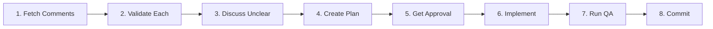

# Handling PR Review Comments

## Overview

**Code review feedback requires validation before implementation.** The natural instinct is "fix-first, ask-later" - this skill enforces the opposite: validate, plan, approve, then fix.

**Core principle:** Being helpful means getting approval first, not moving fast.

## When to Use

Use this skill when:
- Receiving PR review comments
- Multiple review comments need addressing
- Under time pressure ("urgent", "blocking production", "hotfix")
- Comments seem "obvious" or "straightforward"
- Tempted to batch-fix multiple issues together

**Key symptom:** Thinking "I'll just fix these quickly" or "these are straightforward changes"

## The Iron Law

```
NO FIXES WITHOUT USER APPROVAL
```

Urgency does NOT create exceptions.
Volume does NOT justify batch-processing.
"Obvious" fixes still require approval.

**Violating the letter of this rule is violating the spirit of the rule.**

## Core Workflow

**Required sequence (no shortcuts):**



### 1. Fetch Comments

Use `gh` CLI to fetch all PR review comments. Auto-detect owner/repo from git remote when possible.

**Inline review comments (code-level):**
```bash
gh api repos/{owner}/{repo}/pulls/{pr}/comments --jq '.[] | {path, line, body, user: .user.login, in_reply_to_id, created_at}'
```

**General PR comments (conversation-level):**
```bash
gh api repos/{owner}/{repo}/issues/{pr}/comments --jq '.[] | {body, user: .user.login, created_at}'
```

**Quick overview:**
```bash
gh pr view {pr} --comments
```

**Auto-detect owner/repo:**
```bash
gh repo view --json owner,name --jq '"\(.owner.login)/\(.name)"'
```

Read ALL comments before acting on ANY comment.

### 2. Validate Each Comment

For EACH comment, determine:
- Is this clear or ambiguous?
- Is this a simple fix or architectural decision?
- Does this reference correct line numbers/files?
- Do I need more context?

**DO NOT assume. DO NOT skip unclear comments.**

### 3. Discuss Unclear Comments

If ANY comment is:
- Ambiguous ("consider renaming" - to what?)
- References non-existent lines/files
- Involves architectural decisions
- Contradicts other comments

-> **STOP. Ask user for clarification.**

### 4. Create Plan Summary

Write a SHORT plan showing:
- Which comments you will address
- How you will address them
- Which comments need discussion
- Which files will be changed

**Format:**
```
## Review Comments Plan

**Clear fixes:**
- Comment 1: Fix wording in configuration.md:106
- Comment 3: Add code example to resource-schemas.md:111

**Need discussion:**
- Comment 2: Reviewer asks about `final` keyword - needs clarification on project convention

**Skipping (with reason):**
- None

Changes will affect: configuration.md, resource-schemas.md
```

### 5. Get User Approval

Present the plan and wait for explicit approval.

**DO NOT:**
- Assume silence = approval
- Say "I'll proceed unless you object"
- Start implementing while waiting

### 6. Implement Fixes

Only after approval, make the changes.

### 7. Run QA Validation

Use the `spryker-ci` skill to run the documentation QA tools:

- **Vale linter** (prose quality)
- **Markdown linter** - markdownlint-cli2 (markdown syntax)
- **Sidebar checker** (navigation integrity)

Invoke via: `/spryker-ci`

**Critical:** QA passing does NOT mean review comments were properly addressed.

QA catches: prose errors, markdown syntax, sidebar mismatches
QA does NOT catch: wrong fixes, misunderstood comments, logic errors

If QA fails -> Fix issues -> Ask if you should proceed

### 8. Commit Changes

**Format:**
```
{JIRA-TICKET} Fixed review comments.
```

**Example:**
```
FRW-12345 Fixed review comments.
```

Use git add to stage specific files (not `git add .` or `git add -A`).

## Red Flags - STOP and Follow Process

These thoughts mean you are about to violate the workflow:

| Thought | Reality |
|---------|---------|
| "These fixes are obvious/straightforward" | Obvious to you does not equal correct. Get approval. |
| "Let me be helpful and fix quickly" | Helpful = approval first, not speed. |
| "QA passed, so it is safe" | QA does not catch wrong fixes or misunderstood comments. |
| "This is urgent/blocking/production" | Urgency INCREASES need for validation. Follow process. |
| "I will handle these efficiently" | Efficient does not equal batch without approval. |
| "The comment seems wrong/outdated" | Ask for clarification. Never assume. |
| "I will fix first, explain later" | ALWAYS: validate -> plan -> approve -> fix. |
| "Let me just tackle the simple ones first" | Every comment needs validation and approval. |
| "Since QA passed, must be ready" | QA does not equal review validation. Separate concerns. |

**All of these mean: STOP. Return to workflow step 1.**

## Common Rationalizations

| Rationalization | Reality |
|----------------|---------|
| "Fixes seemed obvious" | Reviews catch non-obvious issues. That is their purpose. |
| "Wanted to be helpful by completing quickly" | Helpful = thorough, not fast. Wrong fixes waste more time. |
| "URGENT/production bug creates pressure to act" | Pressure increases mistake risk. Process protects against this. |
| "QA passed = safe to proceed" | QA validates code quality, not review comprehension. |
| "Comments are accurate enough to act on" | "Enough" does not equal correct. Validate each comment. |
| "Comment seems invalid, so I will skip it" | Invalid comments need clarification, not assumptions. |
| "I will fix-first and ask-later" | You will fix wrong things. Always approve first. |
| "Since it is urgent, validation is optional" | Urgency makes validation MORE critical, not less. |
| "Let me batch these for efficiency" | Batching prevents individual validation. |
| "Review spent time on this, I should act quickly" | Reviewer spent time = deserves thoughtful response. |

## No Exceptions

**No matter what:**
- Not for "urgent" PRs
- Not for "simple" fixes
- Not for "blocking" issues
- Not for "obvious" changes
- Not when "QA passed"
- Not when "production is down"
- Not when "team is waiting"

**Urgency is NOT a reason to skip steps.**

Urgency is a reason to follow process MORE carefully, because mistakes under pressure are more likely and more costly.

## Common Mistakes

### Mistake 1: Batch-Fixing Without Individual Validation

**Wrong:**
```
I see 5 comments. Let me fix all of them:
- Comment 1: Fixed wording
- Comment 2: Added example
- Comment 3: Updated path
- Comment 4: Renamed variable
- Comment 5: Added note

Changes committed.
```

**Correct:**
```
I see 5 comments. Let me validate each:

Comment 1: Fix wording - Clear, line matches
Comment 2: Add example - Unclear, what kind of example?
Comment 3: Update path - Clear, line matches
Comment 4: Rename variable - Unclear, to what name?
Comment 5: Add note - Clear, line matches

Need clarification on Comments 2 and 4 before proceeding.
```

### Mistake 2: "QA Passed = Done"

**Wrong:**
```
I ran QA validation and everything passed.
The PR is ready to merge!
```

**Correct:**
```
I ran QA validation and everything passed.
QA confirms documentation quality is good.

However, I still need to validate the review comments:
- Comment 1 about line 89: File only has 55 lines - need clarification
- Comment 2 about naming: This is a generated file - need discussion
- Comment 3 about role: Not defined OOTB - need confirmation

Should I proceed to address these with the reviewer?
```

### Mistake 3: Urgency = Skip Approval

**Wrong:**
```
Since this is urgent and blocking production,
I will fix these review comments right away.
[makes changes]
Done! Ready to merge.
```

**Correct:**
```
I understand this is urgent and blocking production.

Because it is urgent, I want to ensure we fix it correctly the first time.
Here is my plan for the review comments:
[plan summary]

Please approve so I can proceed carefully.
```

## Success Checklist

Before committing, verify:
- [ ] Fetched and read ALL comments (inline + general)
- [ ] Validated EACH comment individually
- [ ] Asked for clarification on ANY unclear comment
- [ ] Created plan summary
- [ ] Got explicit user approval for the plan
- [ ] Implemented only approved changes
- [ ] Ran QA validation via `spryker-ci` skill
- [ ] Addressed any QA issues
- [ ] Committed with correct format: `{JIRA-TICKET} Fixed review comments.`

**If ANY checkbox is unchecked, you violated the workflow.**

## The Bottom Line

Code review feedback is valuable. Rushing through it wastes the reviewer's time and introduces bugs.

Fast fixes -> Wrong fixes -> More review rounds -> Slower overall

Validated fixes -> Right fixes -> One review round -> Faster overall

**Always: Validate -> Plan -> Approve -> Fix -> QA -> Commit**

No exceptions. No shortcuts. No urgency justifications.
