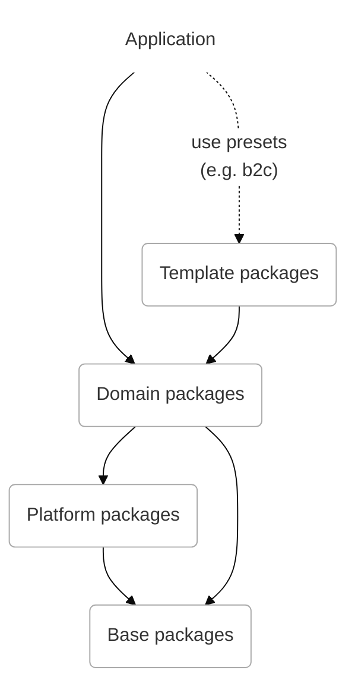

While the Oryx code base is [available on Github](https://github.com/spryker/oryx/), the code is published and distributed as so-called packages on npm. npmjs.com is a widely used registry that is used to packages. Package managers (e.g. npm, yarn, deno, bun, etc) can be used to install the dependencies in a project. The dependencies are typically configured in the package.json file of your application.

The Oryx [packages](./packages.md) are distributed on under the [spryker-oryx](https://www.npmjs.com/org/spryker-oryx) organization. Each time a new version is published, the version number is bumped, see versioning for more information on the version strategy

<!-- Add link to version.md (see https://spryker.atlassian.net/browse/HRZ-2147) -->

You are encourage to [install](./set-up-oryx.md) the packages to your application rather than cloning the Oryx repository. By depending on packages, you can upgrade to later versions of the packages going forward with little effort.

## Layers

While packages are all distributed as a flat list, there is an architectural hierarchy. The hierarchy is important as it will protect from cyclic dependencies. Packages inside a layer can depend on sibling packages inside the layer without any issues. Packages can never depend on a layer above.

While the package layering might not be relevant during your development, it might help you to better understand the package dependencies. The diagram below shows you the four package layers, the top layer in the diagram is the [boilerplate application](./boilerplate.md) that uses a preset to setup the a standard application.

<!-- Add link to presets.md (see https://spryker.atlassian.net/browse/HRZ-2153) -->

### Template packages

The template layer contains packages that can be used as quick starters for demos and projects. Templated packages do follow semantic versioning and will deliver on the promise of upgradability, but are fairly opinionated as they mainly serve to get up to speed fast with a standard frontend application.

| Packages                                                       | Location                    |
| -------------------------------------------------------------- | --------------------------- |
|                                                                |                             |
| [Application](https://www.npmjs.com/package/@spryker-oryx/)    | `@spryker-oryx/application` |
| [Presets](https://www.npmjs.com/package/@spryker-oryx/presets) | `@spryker-oryx/presets`     |
| [Labs ](https://www.npmjs.com/package/@spryker-oryx/labs)      | `@spryker-oryx/labs`        |
| [Themes ](https://www.npmjs.com/package/@spryker-oryx/themes)  | `@spryker-oryx/themes`      |

> **Note:** the labs package is an exception here. The labs package consists of experimental or demo functionality and is not recommended to be used in production.

### Domain packages

Domain packages provide components, services and adapters for a certain domain. Organising packages in domains helps the developer experience, as its' fairly easy to understand where to find a certain component or service. An example of a domain package is the `product` package, which contains all product related components as well as the product services and adapters that integrates with Spryker APIs.

| Packages                                                         | Location                 |
| ---------------------------------------------------------------- | ------------------------ |
| [Auth](https://www.npmjs.com/package/@spryker-oryx/auth)         | `@spryker-oryx/auth`     |
| [Cart](https://www.npmjs.com/package/@spryker-oryx/cart)         | `@spryker-oryx/cart`     |
| [Checkout](https://www.npmjs.com/package/@spryker-oryx/checkout) | `@spryker-oryx/checkout` |
| [Content](https://www.npmjs.com/package/@spryker-oryx/content)   | `@spryker-oryx/content`  |
| [Order](https://www.npmjs.com/package/@spryker-oryx/order)       | `@spryker-oryx/order`    |
| [picking](https://www.npmjs.com/package/@spryker-oryx/picking)   | `@spryker-oryx/picking`  |
| [Product](https://www.npmjs.com/package/@spryker-oryx/product)   | `@spryker-oryx/product`  |
| [Search](https://www.npmjs.com/package/@spryker-oryx/search)     | `@spryker-oryx/search`   |
| [Site](https://www.npmjs.com/package/@spryker-oryx/site)         | `@spryker-oryx/site`     |
| [User](https://www.npmjs.com/package/@spryker-oryx/user)         | `@spryker-oryx/user`     |

### Platform packages

The platform layer contains the core packages, including `core` itself. They are providing the infrastructure to the whole system.

| Packages                                                                           | Location                          |
| ---------------------------------------------------------------------------------- | --------------------------------- |
| [Core](https://www.npmjs.com/package/@spryker-oryx/core)                           | `@spryker-oryx/core`              |
| [Experience](https://www.npmjs.com/package/@spryker-oryx/experience)               | `@spryker-oryx/experience`        |
| [I18n](https://www.npmjs.com/package/@spryker-oryx/I18n)                           | `@spryker-oryx/i18n`              |
| [Indexed-db](https://www.npmjs.com/package/@spryker-oryx/indexed-db)               | `@spryker-oryx/indexed-db`        |
| [offline](https://www.npmjs.com/package/@spryker-oryx/offline)                     | `@spryker-oryx/offline`           |
| [push-notification](https://www.npmjs.com/package/@spryker-oryx/push-notification) | `@spryker-oryx/push-notification` |
| [router](https://www.npmjs.com/package/@spryker-oryx/router)                       | `@spryker-oryx/router`            |

### Base packages

The base layer contains packages that serve as utilities to all above layers. An important part of the base layer is the design system package (UI).

| Packages                                                           | Location                  |
| ------------------------------------------------------------------ | ------------------------- |
| [UI](https://www.npmjs.com/package/@spryker-oryx/ui)               | `@spryker-oryx/ui`        |
| [Form](https://www.npmjs.com/package/@spryker-oryx/form)           | `@spryker-oryx/form`      |
| [Utilities](https://www.npmjs.com/package/@spryker-oryx/utilities) | `@spryker-oryx/utilities` |
| [DI](https://www.npmjs.com/package/@spryker-oryx/di)               | `@spryker-oryx/di`        |
