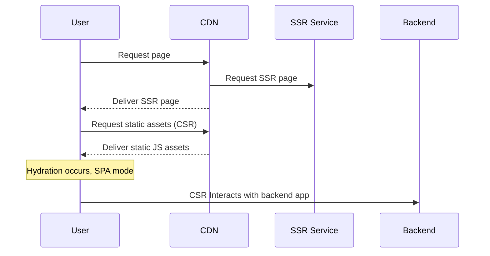

## Introduction to SSR

### Overview and need for SSR

Server-Side Rendering (SSR) is a popular rendering technique used in web applications to improve the performance, search engine optimization (SEO), and user experience. It involves rendering the initial HTML content of a web page on the server before sending it to the client. This results in faster page load times, improved SEO, and better user experience since users don't have to wait for the JavaScript to load and render content on the client-side.

The need for SSR arises from the limitations of Client-Side Rendering (CSR), where the browser downloads, parses, and executes JavaScript to render the page content. CSR can lead to slow initial page loads and may hinder the performance of web applications, especially on low-end devices or slow networks. Additionally, search engine crawlers may not effectively index CSR-based web pages, affecting the site's SEO.

### SSR vs. Client-Side Rendering (CSR)

**Performance**: SSR outperforms CSR in terms of initial page load times due to server-side HTML rendering. Conversely, CSR might cause slower initial rendering as the client's browser must download, parse, and execute JavaScript.

**SEO**: SSR, with its pre-rendered HTML content, facilitates efficient indexing by search engine crawlers, thereby enhancing SEO. CSR's JavaScript-rendered content might not be indexed as effectively, potentially undermining SEO.

**User experience**: SSR typically provides a superior user experience by delivering content more quickly, thereby minimizing wait times.

**Resource usage**: SSR, despite its benefits, demands more server resources and processing power. CSR, on the other hand, delegates rendering to the client, thus leveraging client resources.

### Pros and Cons of SSR:

| Pros                           | Cons |
|--------------------------------|------|
| Rapid initial page load times. | Increased demand for server resources and processing power. |
| Enhanced SEO.                  | Possible ineffectiveness for highly interactive web applications. |
| Improved user experience.     | Necessitates more complex development and deployment processes. |
| Consistency of user interface across various devices and networks. | |


## SSR Implementation
### Traditional server-based SSR
### Serverless SSR using Lambda
### Caching, CDN


## SSR Implementation

### Traditional server-based SSR

Traditional SSR implementation involves rendering the initial HTML content on a server, typically powered by Node.js. Oryx supports this scenario for both development and production builds with `createServer` utility in `@spryker-oryx/application/server` package:

```ts
  import { createServer } from '@spryker-oryx/application/server';

  createServer(config).run();
```

`createServer` utility is using ExpressJS server under the hood and provides a convenient way to configure and run the server and also exposes the ExpressJS server instance for further customization.

### Serverless SSR using Lambda

Serverless SSR, on the other hand, employs on-demand serverless platforms such as AWS Lambda for HTML rendering, eliminating the need for a dedicated server. 

Oryx supports this scenario for both development and production builds with `storefrontHandler` utility in `@spryker-oryx/application/lambda'` package:

```ts
import { storefrontHandler } from '@spryker-oryx/application/lambda';

return (event, context) => storefrontHandler(event, {
    ...context,
    root: 'file:///apps/storefront/functions/ssr/index.js',
    index: '../../client/index.html',
    entry: '../../server/render.js',
    component: '<root-app></root-app>',
});
```

### Caching, CDN

Caching and CDNs are additional layers that can significantly enhance the performance of SSR applications by reducing server load and accelerating content delivery.

**Caching**: Caching acts as a layer on top of rendering. Once the HTML content is rendered, it's cached to swiftly serve repeated requests without the need for re-rendering. Various caching solutions could be used, such as Varnish, Redis, or even service-specific solutions such as Cloudflare's caching services.

**Content Delivery Networks (CDNs)**: CDNs distribute cached content across a network of servers located worldwide. This ensures that users receive content from the nearest server, which significantly improves delivery speed and reduces latency.

In the context of serverless platforms like Netlify, you can leverage Netlify's on-demand builder.
It works as a simple wrapper to SSR Lambda handler and automatically feed Netlify Edge CDN by building and caching a page when it's requested, thereby reducing the load on the serverless function and improving performance.



## SSR in Oryx

### Configuration

Oryx integrates seamlessly with server environments, offering support for both traditional Node.js server-side rendering (SSR) and serverless architectures, akin to AWS Lambda or Netlify functions.

For Node.js SSR, Oryx leverages ExpressJS, a minimalist web framework for Node.js. By utilizing the `createServer` method, Oryx is capable of spinning up an ExpressJS server configured for SSR out of the box.

Simultaneously, Oryx caters to the increasing demand for serverless architectures. The `storefrontHandler` method enables SSR in AWS Lambda-like environments, providing a flexible solution for serverless deployments.

While both approaches offer sensible configuration tailored to most deployment scenarios, it also exposes a lower-level API, allowing advanced customization to cater to unique project requirements.

### Build with SSR support

Oryx has been designed from the ground up with SSR support in mind, ensuring that all components render correctly on the server side. This ingrained support for SSR enables Oryx to deliver faster initial page load times and improved SEO out of the box.

Moreover, Oryx supports late and partial hydration that further optimizes performance. This approach ensures that only the necessary components are hydrated when they are required, reducing the amount of JavaScript that needs to be parsed and executed on the client side.

### 3.3 Hydration

Following the "islands architecture" approach, Oryx goes beyond traditional hydration strategies. Instead of hydrating the entire application at once, Oryx allows developers to selectively hydrate components or "islands" on the page. This partial hydration strategy delivers performance benefits, as it reduces the amount of JavaScript needed for initial page interaction.

Furthermore, Oryx adopts a "late hydration" strategy, which delays the hydration process until a user interacts with a component. This strategy ensures that resources are used only when necessary, offering an efficient and responsive user experience.


## 4. Developing with SSR

### 4.1 SSR Consideration

When developing with SSR, it's important to understand how the SSR process works. SSR involves rendering the initial HTML on the server, which is then sent to the client. This provides faster initial page load times and better SEO. However, because this process can differ from traditional client-side rendering, there are specific considerations and potential pitfalls to keep in mind, such as avoiding direct manipulation of the DOM and being mindful of lifecycle hooks.

### 4.2 SSR-aware Components

Oryx components are built with SSR in mind. They're designed to render correctly on the server and work with late and partial hydration. However, when building custom components, be aware of the SSR lifecycle and the potential issues that may arise, such as the `unsafeStatic` issue, which can lead to unexpected behavior during the SSR process.

### 4.3 Decorators

Oryx provides special decorators to address some SSR related challenges:

- The `@hydratable` decorator marks a component for late hydration. This allows the component to render on the server but delays its hydration until it's interacted with on the client. Hydration can be triggered programmatically, or automatically with events.   

- The `@ssrShim` decorator shims some component API in order to make it work on the Server: `toggleAttribute()` and `style` property. 

### 4.4 Utilities

Oryx also provides utilities to assist with SSR:

- `ssrAwaiter`: This utility manages asynchronous operations during SSR. It's particularly useful when a component depends on asynchronous data. By using `ssrAwaiter`, you can ensure that the server waits for the data before rendering the component. 

- `@subscribe`: This decorator can be used to manage subscriptions during SSR. It solves the problem of missing lifecycle hooks in SSR and ensures that subscriptions are cleaned up properly. However, note that it currently can't be used with the `observe` controller.
