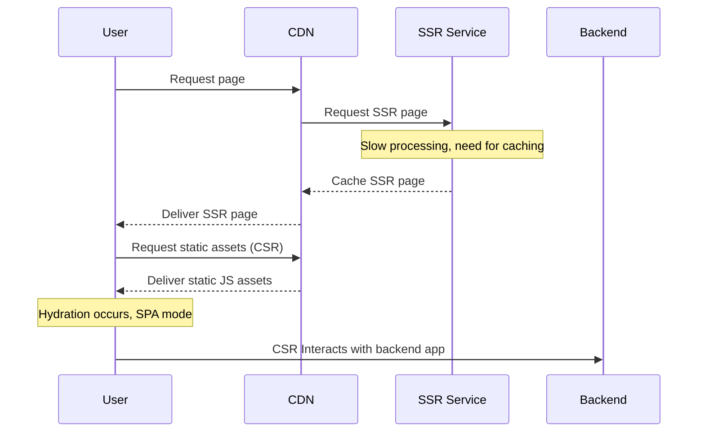

## Introduction to SSR

### Why SSR?

Server-Side Rendering (SSR), including Static Site Generation (SSG) as a variant, has grown in popularity due to its ability to boost web application performance, facilitate effective Search Engine Optimization (SEO), social sharing, and improve Core Web Vitals (CWV). By delivering pre-rendered HTML from the server (or even CDN) to the client, SSR and SSG lead to quicker initial page load times, enhance the user experience, and can significantly improve CWV scores. SSG, in particular, pre-renders HTML at build time, resulting in static HTML, CSS, and JavaScript files that can be served directly from a CDN. It is a useful strategy for sites with content that does not change frequently, and can improve performance, scalability, and security.

### SSR vs. CSR: Understanding the Differences

**Speed & Performance**: With SSR, the browser receives pre-rendered HTML, reducing the time taken to display meaningful content.

**SEO**: SSR is typically more favorable for SEO since search engine crawlers find it easier to index pre-rendered HTML content.

**Social Media Integration**: SSR significantly improves integration with social providers like Facebook and Twitter, and bots like Slack. It enables the generation of link previews, rich snippets, and thumbnails, enhancing the visibility and appeal of shared content on these platforms.

**User Experience**: By delivering pre-rendered content faster, SSR minimizes user waiting time, providing a superior user experience compared to CSR.

**Resource Allocation**: While SSR enhances performance and user experience, it requires more server resources and processing power. CSR lightens server load by offloading rendering to the client, but at the cost of potentially increased load times and less effective SEO.

### SSR: Pros and Cons

| Benefits of SSR                                                   | Drawbacks of SSR    |
|-------------------------------------------------------------------|---------------------|
| Quicker initial page load times.                                  | Higher server resource usage. |
| Enhanced SEO.                                                     | Increased development and deployment complexity. |
| Improved user experience.                                         | Infrastructure concerns. |
| Better social media integration.                                  | Potential for stale content. |

#### Applicability of SSR

While SSR offers numerous benefits, it may not be the best fit for every type of application, for example:

- **B2B (Closed) Shops**: Public-facing SEO and quicker initial page load times offered by SSR may not significantly benefit these types of applications.
- **Business Apps**: Applications heavily focused on functionality, like a fulfillment app, might not require the SEO or user experience enhancements provided by SSR.
- **Instore Apps**: Used in a controlled environment and designed for specific functions, these types of applications might not necessitate the benefits of SSR.

## SSR Implementation Approaches

### Traditional server-based SSR

Traditional SSR implementation involves rendering the initial HTML content on a server, typically powered by Node.js.

### Serverless SSR using Lambda

Serverless SSR, on the other hand, employs on-demand serverless platforms such as AWS Lambda for HTML rendering, eliminating the need for a dedicated server. 

### SSG: Static Site Generation

SSG is a variant of SSR where the server generates static HTML pages at build time. These pages can be directly served from a CDN, reducing server load and accelerating delivery. This approach is particularly effective for sites where content does not change often. SSG enhances load times, scalability, and security.

### Caching, CDN

Caching and CDNs are additional layers that can significantly enhance the performance of SSR applications by reducing server load and accelerating content delivery.

**Caching**: Caching acts as a layer on top of rendering. Once the HTML content is rendered, it's cached to swiftly serve repeated requests without the need for re-rendering. Various caching solutions could be used, such as Varnish, Redis, or even service-specific solutions such as Cloudflare's caching services.

**Content Delivery Networks (CDNs)**: CDNs distribute cached content across a network of servers located worldwide. This ensures that users receive content from the nearest server, which significantly improves delivery speed and reduces latency.

In the context of serverless platforms like Netlify, you can leverage Netlify's on-demand builder.
It works as a simple wrapper to Oryx SSR Lambda handler and automatically feed Netlify Edge CDN by building and caching a page when it's requested, thereby reducing the load on the serverless function and improving performance.

### Hydration

In the context of SSR, hydration refers to the process where the client-side JavaScript runtime takes over the static HTML sent by the server and turns it into a dynamic Document Object Model (DOM).

In most applications, hydration happens all at once. But Oryx follows a more strategic approach known as "islands architecture". It enables selective hydration of components or "islands" on a need basis, thereby reducing the amount of JavaScript parsed and executed during initial page interaction.

Moreover, Oryx employs a "late hydration" strategy, delaying the hydration process until the user interacts with a component. This ensures that client-side resources are only utilized when absolutely necessary, fostering an efficient and highly responsive user experience.

## Developing with SSR

### SSR Consideration

When developing with SSR, it's important to understand how the SSR process works. SSR involves rendering the initial HTML on the server, which is then sent to the client. This provides faster initial page load times and better SEO. However, because this process can differ from traditional client-side rendering, there are specific considerations and potential pitfalls to keep in mind, such as avoiding direct manipulation of the DOM and being mindful of lifecycle hooks.

### Configuration

Oryx integrates seamlessly with server environments, offering support for both traditional Node.js server-side rendering (SSR) and serverless architectures, akin to AWS Lambda or Netlify functions.

For Node.js SSR, Oryx leverages ExpressJS, a minimalist web framework for Node.js. By utilizing the `createServer` method, Oryx is capable of spinning up an ExpressJS server configured for SSR out of the box.

Simultaneously, Oryx caters to the increasing demand for serverless architectures. The `storefrontHandler` method enables SSR in AWS Lambda-like environments, providing a flexible solution for serverless deployments.

While both approaches offer sensible configuration tailored to most deployment scenarios, it also exposes a lower-level API, allowing advanced customization to cater to unique project requirements.

### Building with SSR Support

Designed with SSR at its core, Oryx ensures that all components correctly render server-side. This design choice brings about inherent advantages such as rapid initial page load times and boosted SEO, right out of the box.

Additionally, Oryx features mechanisms that further enhance performance by managing the hydration process intelligently.

### SSR-aware Components

Oryx components are built with SSR in mind. They're designed to render correctly on the server and work with late and partial hydration. However, when building custom components, be aware of the SSR lifecycle and the potential issues that may arise, such as the `unsafeStatic` issue, which can lead to unexpected behavior during the SSR process.

### Decorators

Oryx provides special decorators to address some SSR related challenges:

- The `@hydratable` decorator marks a component for late hydration. This allows the component to render on the server but delays its hydration until it's interacted with on the client. Hydration can be triggered programmatically, or automatically with events.   

- The `@ssrShim` decorator shims some component API in order to make it work on the Server: `toggleAttribute()` and `style` property. 

### Utilities

Oryx also provides utilities to assist with SSR:

- `ssrAwaiter`: This utility manages asynchronous operations during SSR. It's particularly useful when a component depends on asynchronous data. By using `ssrAwaiter`, you can ensure that the server waits for the data before rendering the component. 

- `@subscribe`: This decorator can be used to manage subscriptions during SSR. It solves the problem of missing lifecycle hooks in SSR and ensures that subscriptions are cleaned up properly. However, note that it currently can't be used with the `observe` controller.
