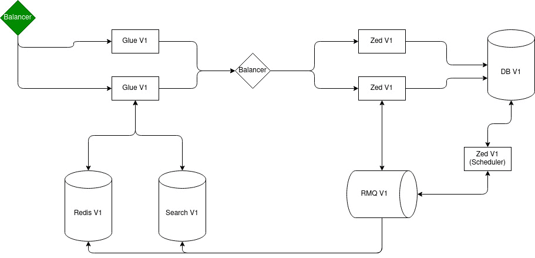
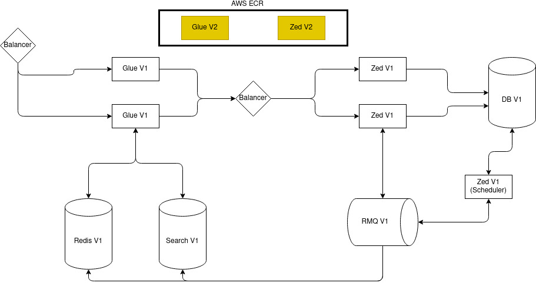
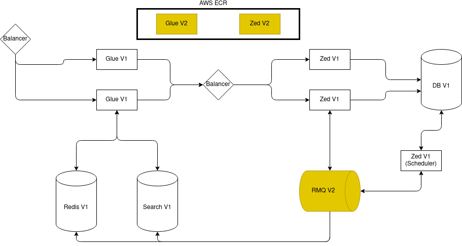
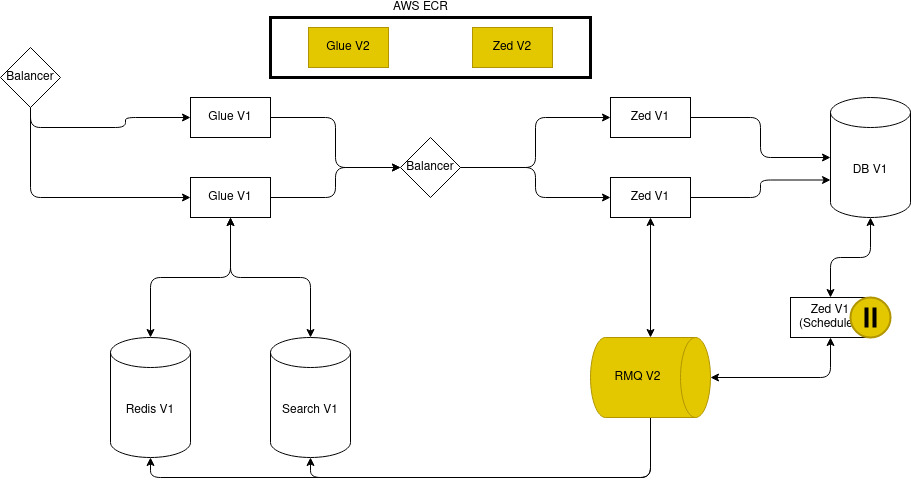
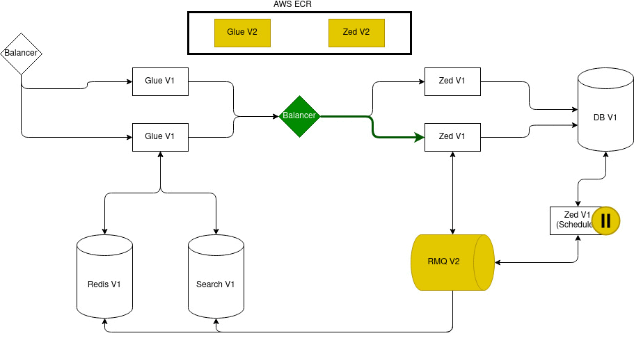
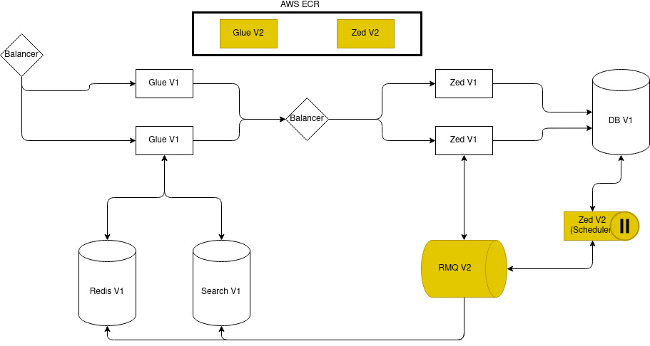
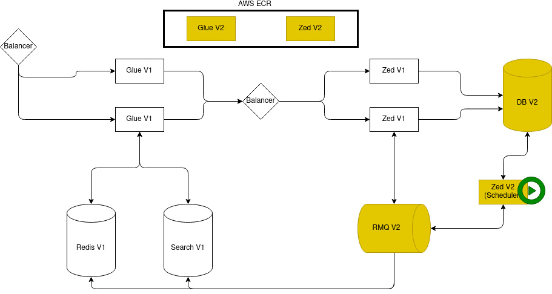
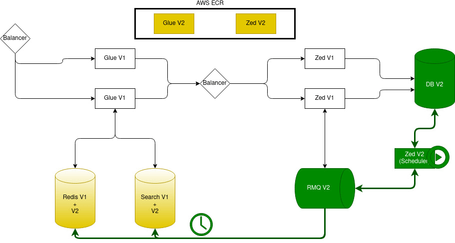
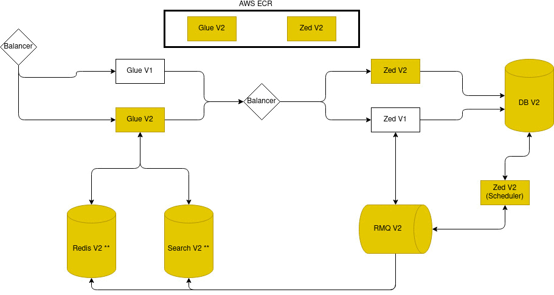

When it comes to complex applications, deploying to production environments is not just going from version one to version two. This document describes the states which an application goes through during a deployment, potential issues, and what you need to do to avoid them.

## Prerequisites

To learn how pipelines work in Spryker Cloud Commerce OS, see [Deployment pipelines](/docs/cloud/dev/spryker-cloud-commerce-os/configuring-deployment-pipelines/deployment-pipelines.html).

## Production pipeline steps

A regular production pipeline contains the following steps. Highlighted in *italic* are the steps that may break or impact the application.

* Source
* Please_approve
* Build_and_Prepare
* *Configure_RabbitMQ_Vhosts_and_Permissions*
* *Run_pre-deploy_hook*
* Pre_Deployment_Configuration
* *Deploy_Scheduler*
* *Run_install*
* *Deploy_Spryker_services*
* UpdateDeployedVersion
* Post_Deployment_Configuration
* *Run_post-deploy_hook*

The following sections describe the potential issues applications can encounter during each step of deployment. To cover all the issues, we use pessimistic scenarios. During an actual deployment, an application is more likely to encounter one of the issues than all of them.

## Initial state

This is how an working application behaves when no pipeline is running:



## Build_and_Prepare

In this step, the containers of the services that are going to deployed are built. For the sake of simplicity, we use only Glue and Zed in our examples.



## Configure_RabbitMQ_Vhosts_and_Permissions

In this step, Rabbit MQ vhosts, users, and permissions are updated. Usually, you would change them rarely, but, if you do, while they are being updated, the following happens:



### Run_pre-deploy_hook

In this step, the following happens:
* The scripts you defined for this step in the `SPRYKER_HOOK_BEFORE_DEPLOY` are run. The default command is `vendor/bin/install -r pre-deploy -vvv`.
* The scheduler stops. It waits for the currently running jobs to finish and gracefully shuts down. Stopping the scheduler prevents data corruption or errors for the duration of the deployment.



While the scripts you defined are running and the scheduler finishes the currently running jobs, requests keep coming in. For this duration, all the services that are in an updated state may respond incorrectly to requests:



### Deploy_Scheduler

In this step, scheduler V2 is deployed. Because the scheduler has been paused, it will not run against incorrect data or services.



Scheduler is based on the Zed container, as it uses the codebase of Zed.




During this step, all the services in an updated state may still respond to requests incorrectly:



### Run_install

In this step, the scripts in the `SPRYKER_HOOK_INSTALL` are run. By default, it is `vendor/bin/install -r EU/production --no-ansi -vvv`.

The script runs all the propel database migrations, so the database is updated to V2. However, Search and Redis are not, as we "paused" the synchronization.


From this point on, all the V1 services that are communicating with the database may respond to requests incorrectly. For each request, it depends on what data was migrated. For example, Glue V1 retrieves information about a product from Redis V1 and Search V1. Then Glue V1 makes a request to the the database to put the product to cart. Depending on whether the product still exists in the database, 

At the very end of this step, we re-enable our scheduler, and setup the new jobs (if there was any)
```shell
vendor/bin/console scheduler:setup -vvv --no-ansi
```
When this command run, it will restart our queue workers, and update search and redis.



Depending on the amount of data that needs to be processed, this process may take a while. While Redis and search are being updated, they cannot process the requests the are coming in:



### Deploy_Spryker_services
Finally, we are going to deploy our services with the updated codebase. (Zed V2, Glue V2).
For the sake of simplicity, let's assume that Redis and search are done updating. (We leave the asterisks on the schema, as a reminder that it might not be the case, it depends on the size of the migration)


This process takes some time. AWS first spawn our v2 services, and when they are up and running, they take V1 down.
We do not control this process, so there is potentially a timeframe here where the application will run V1 and V2 or services in a random combination. (pessimistic approach)




### Run_post-deploy_hook
This step is the final step that has an impact on the pipeline. It runs the script associated with the constant `SPRYKER_HOOK_AFTER_DEPLOY`. By default, it is not associated with any script.
We mention it here, because we need to keep in mind that any script run during the pipeline will have an impact on the total running time of the deployment.

That's all.
