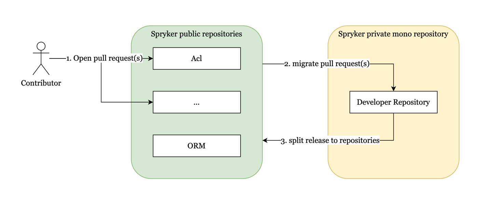

In Spryker, we welcome contributions in all forms, be it detailed Issues or Pull Requests (PRs). As PRs directly show the changes and the context, we verify and ship them faster. Therefore, *PRs are the preferred method of contribution*.

## Licenses

Spryker uses different licenses: our proprietary licenses and common open-source licenses. In general, you can contribute to our public repositories
- [spryker](https://github.com/spryker)
- [spryker-shop](https://github.com/spryker-shop)
- [spryker-eco](https://github.com/spryker-eco)
- [spryker-sdk](https://github.com/spryker-sdk)
- [spryker-middleware](https://github.com/spryker-middleware)

You can review the current version of our Contribution License Agreement (CLA) <a href="https://docs.spryker.com/docs/dg/dev/code-contribution-guide/{{page.version}}/contribution-license-agreement.html" target="_blank">here</a>.

## Opening pull requests

To contribute to a Spryker repository, follow these steps:
1. Fork the repository and create a branch with your changes. Ensure that the commit messages explain the aim of the applied changes or fixes.
2. Open a PR in the repository. Ensure that the title and description clearly describe the context of your work.
3. Review and understand the terms outlined in the <a href="https://docs.spryker.com/docs/dg/dev/code-contribution-guide/{{page.version}}/contribution-license-agreement.html" target="_blank">Contribution License Agreement</a>.
4. If you agree to the terms, confirm your acceptance by adding a file named `contribution-license-agreement.txt` to the root of your pull request with the following content:

```
I hereby agree to Spryker's Contribution License Agreement under https://docs.spryker.com/docs/dg/dev/code-contribution-guide/{{page.version}}/contribution-license-agreement.html.
```

If we cannot merge a PR due to our release process, we manually introduce the change. Once the change is released, we inform you by closing the PR.

Please note that pull requests without a signed Contribution License Agreement will not be merged until this requirement is fulfilled.
We believe that this process will help maintain the integrity of our projects and protect the interests of all contributors.

## Mono-repository

The opened PRs are processed using a special workflow since the Spryker repositories are mainly developed via a mono-repository solution:
<div style="text-align:center;"></div>


## When will you process my request?

The processing time depends on the importance of the changes and the amount of work required to check and implement the changes. In case an important change is requested via a PR, we may be able to ship it within one day.

If you create a PR and feel that the issue is important, [contact our support](https://spryker.force.com/support/s/) to speed up the process.

---
**See also:**

[Contribute to documentation](/docs/scos/user/intro-to-spryker/contribute-to-the-documentation/contribute-to-the-documentation.html)
