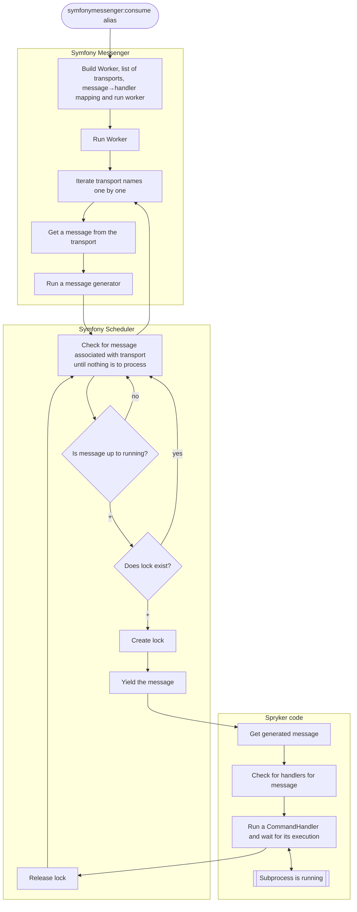

This document describes how to integrate Symfony Scheduler module into a Spryker project.

## Install

Install the required modules using Composer:

```shell
composer require spryker/symfony-scheduler
```



Ensure that the following modules have been installed:

| MODULE                    | EXPECTED DIRECTORY                |
|---------------------------|-----------------------------------|
| SymfonyScheduler          | vendor/spryker/symfony-scheduler  |
| SymfonySchedulerExtension | vendor/spryker/symfony-scheduler  |



In addition make sure that the Symfony Messenger module is also installed and configured, as Symfony Scheduler relies on it for message handling. See the [Symfony Messenger integration guide](/docs/dg/dev/integrate-and-configure/integrate-symfony-messenger.html) for more details.

## Configure

To configure the Symfony Scheduler module, you need to define your scheduled tasks and their execution intervals.
With the current implementation you can add them in the module config or provide them via a plugin.

### Configure via Module Config

In the example below we are adding all the jobs that we have in our project in `jenkins.php` file, but you can add only the ones that you want to be executed by the scheduler.
```php
<?php

namespace Pyz\Zed\SymfonyScheduler;

use Spryker\Shared\MessageBroker\MessageBrokerConstants;
use Spryker\Zed\SymfonyScheduler\SymfonySchedulerConfig as SprykerSymfonySchedulerConfigAlias;

class SymfonySchedulerConfig extends SprykerSymfonySchedulerConfigAlias
{
    public function getCronJobs(): array
    {
        $logger = $this->getLoggerCommand(); // script for jenkins logging

        $jobs = [
            'queue-worker-start' => [
                'command' => $logger . '$PHP_BIN vendor/bin/console queue:worker:start',
                'schedule' => '* * * * *',
            ],
            'check-product-validity' => [
                'command' => $logger . '$PHP_BIN vendor/bin/console product:check-validity',
                'schedule' => '0 6 * * *',
            ],
            'check-product-label-validity' => [
                'command' => $logger . '$PHP_BIN vendor/bin/console product-label:validity',
                'schedule' => '0 6 * * *',
            ],
            'update-product-label-relations' => [
                'command' => $logger . '$PHP_BIN vendor/bin/console product-label:relations:update -vvv --no-touch',
                'schedule' => '* * * * *',
            ],
            'check-oms-conditions' => [
                'command' => $logger . '$PHP_BIN vendor/bin/console oms:check-condition',
                'schedule' => '* * * * *',
            ],
            'check-oms-timeouts' => [
                'command' => $logger . '$PHP_BIN vendor/bin/console oms:check-timeout',
                'schedule' => '* * * * *',
            ],
            'clear-oms-locks' => [
                'command' => $logger . '$PHP_BIN vendor/bin/console oms:clear-locks',
                'schedule' => '0 6 * * *',
            ],
            'product-relation-updater' => [
                'command' => $logger . '$PHP_BIN vendor/bin/console product-relation:update -vvv',
                'schedule' => '30 2 * * *',
            ],
            'event-trigger-timeout' => [
                'command' => $logger . '$PHP_BIN vendor/bin/console event:trigger:timeout',
                'schedule' => '*/5 * * * *',
            ],
            'deactivate-discontinued-products' => [
                'command' => $logger . '$PHP_BIN vendor/bin/console product:deactivate-discontinued-products',
                'schedule' => '0 0 * * *',
            ],
            'clean-expired-guest-cart' => [
                'command' => $logger . '$PHP_BIN vendor/bin/console cart:guest:clean-expired',
                'schedule' => '30 1 * * *',
            ],
            'close-outdated-quote-requests' => [
                'command' => $logger . '$PHP_BIN vendor/bin/console quote-request:close-outdated',
                'schedule' => '0 * * * *',
            ],
            'apply-price-product-schedule' => [
                'command' => $logger . '$PHP_BIN vendor/bin/console price-product:schedule:apply',
                'schedule' => '0 6 * * *',
            ],
            'check-product-offer-validity' => [
                'command' => $logger . '$PHP_BIN vendor/bin/console product-offer:check-validity',
                'schedule' => '0 6 * * *',
            ],
            'remove-expired-refresh-tokens' => [
                'command' => $logger . '$PHP_BIN vendor/bin/console oauth:refresh-token:remove-expired',
                'schedule' => '*/5 * * * *',
            ],
            'delete-expired-customer-invalidated' => [
                'command' => $logger . '$PHP_BIN vendor/bin/console customer:delete-expired-invalidated',
                'schedule' => '0 0 * * 0',
            ],
            'order-invoice-send' => [
                'command' => $logger . '$PHP_BIN vendor/bin/console order:invoice:send',
                'schedule' => '*/5 * * * *',
            ],
            'page-product-abstract-refresh' => [
                'command' => $logger . '$PHP_BIN vendor/bin/console product-page-search:product-abstract-refresh',
                'schedule' => '0 6 * * *',
            ],
            'send-push-notifications' => [
                'command' => $logger . '$PHP_BIN vendor/bin/console push-notification:send',
                'schedule' => '* * * * *',
            ],
            'glue-api-generate-documentation' => [
                'command' => $logger . '$PHP_BIN vendor/bin/glue api:generate:documentation --invalidated-after-interval 90sec',
                'schedule' => '*/1 * * * *',
            ],
            'sync-order-matrix' => [
                'command' => $logger . '$PHP_BIN vendor/bin/console order-matrix:sync',
                'schedule' => '*/1 * * * *',
            ],
            'generate-sitemap-files' => [
                'command' => $logger . '$PHP_BIN vendor/bin/console sitemap:generate',
                'schedule' => '0 0 * * *',
            ],
            'data-import-merchant-import' => [
                'command' => $logger . '$PHP_BIN vendor/bin/console data-import:merchant-import',
                'schedule' => '0 0 * * *',
            ],
        ];

        /* Push notification */
        if (getenv('SPRYKER_PUSH_NOTIFICATION_WEB_PUSH_PHP_VAPID_PUBLIC_KEY')) {
            $jobs['delete-expired-push-notification-subscriptions'] = [
                'command' => $logger . '$PHP_BIN vendor/bin/console push-notification:delete-expired-push-notification-subscriptions',
                'schedule' => '0 0 * * 0',
            ];
        }

        /* Message broker */
        if ($this->get(MessageBrokerConstants::IS_ENABLED)) {
            $jobs['message-broker-consume-channels'] = [
                'command' => $logger . '$PHP_BIN vendor/bin/console message-broker:consume --time-limit=15 --sleep=5',
                'schedule' => '* * * * *',
            ];
        }

        return $jobs;
    }

    protected function getLoggerCommand(): string
    {
        return '';
    }
}
```

The job name is the key of the array, and it MUST be unique for each job as it will be used in order to configure a transport in the Symfony Messenger module. 
The `command` is the console command that you want to execute. All jobs from this configuration will be handled with the same message and handler that will start a process with the provided command on message handling.
The `schedule` is the cron expression that defines when the job should be executed. You can also use aliases like `@hourly`, `@daily`, etc. For more information on how to define the schedule, see the [Symfony Scheduler documentation](https://symfony.com/doc/current/scheduler.html#cron-expression-triggers).
The `no_lock` option is optional and it defines whether the job should be executed without acquiring a lock. This can be useful for jobs that are safe to run in parallel.
In addition you can also provide a `store` or a `region`.

### Configure via new plugin

If your use case is more complex than just executing a console command, you can create a new plugin that implements `\Spryker\Shared\SymfonySchedulerExtension\Dependency\Plugin\SchedulerHandlerProviderPluginInterface`.

```php
<?php

namespace Pyz\Zed\FooBar\Communication\Plugin\SymfonyScheduler;

class FooBarSchedulerHandlerProviderPlugin implements SchedulerHandlerProviderPluginInterface
{
    /**
     * @example
     * return [
     *     RecurringOrderExportMessage::class => [[$this, 'handleOrderExport'],]
     *     RecurringInventorySyncMessage::class => [function(RecurringInventorySyncMessage $message) { ... },]
     *     RecurringReportGenerationMessage::class => [new ReportGenerationHandler(),]
     * ]
     *
     * @return array<string, array<callable>>
     */
    public function getHandlers(): array
    {
        return [
            RecurringReportGenerationMessage::class => [new ReportGenerationHandler(),],
        ];
    }
    public function getSchedules(): array
    {
        $schedule = new Schedule();
        $schedule->add(RecurringMessage::cron('* * * * *'), (new RecurringReportGenerationMessage('report for today'))) // every day at midnight

        return [
            'report-generation' => $schedule
        ];
    }
}
```

If you define you jobs with the first option (via config) or with separate plugin, you need to wire them in the Symfony Scheduler Dependency Provider by adding the following code:

```php
<?php

/**
 * This file is part of the Spryker Suite.
 * For full license information, please view the LICENSE file that was distributed with this source code.
 */

declare(strict_types = 1);

namespace Pyz\Zed\SymfonyScheduler;

use Spryker\Zed\SymfonyScheduler\Communication\Plugin\SymfonyScheduler\CompiledCronTransportsHandlerProviderPlugin;
use Spryker\Zed\SymfonyScheduler\SymfonySchedulerDependencyProvider as SprykerSymfonySchedulerDependencyProvider;

class SymfonySchedulerDependencyProvider extends SprykerSymfonySchedulerDependencyProvider
{
    /**
     * @return array<\Spryker\Shared\SymfonySchedulerExtension\Dependency\Plugin\SchedulerHandlerProviderPluginInterface>
     */
    protected function getSchedulerHandlerProviderPlugins(): array
    {
        return [
            new CompiledCronTransportsHandlerProviderPlugin(), //Plugin that provides handlers for jobs defined in the config
            new FooBarSchedulerHandlerProviderPlugin(), //Plugin that provides handlers for jobs defined in a separate plugin
        ];
    }
}
```

You may notice that there are messages and handlers as you saw in the Symfony Messenger module. This is because the Symfony Scheduler module relies on the Symfony Messenger module for message handling.
Symfony Scheduler module will configure transports for each job defined in the config or provided by the plugins, so you don't need to configure them separately. The message will then be handled by the corresponding handler that you have defined in the Symfony Messenger module. For more information on how to define messages and handlers, see the [Symfony Messenger integration guide](/docs/dg/dev/integrate-and-configure/integrate-symfony-messenger.html). 
The only thing you need to do is to wire `\Spryker\Zed\SymfonyScheduler\Communication\Plugin\SymfonyMessenger\SchedulerAvailableTransportProviderPlugin`, `\Spryker\Zed\SymfonyScheduler\Communication\Plugin\SymfonyMessenger\SchedulerMessageMappingProviderPlugin` and `\Spryker\Zed\SymfonyScheduler\Communication\Plugin\SymfonyMessenger\SchedulerTransportFactoryProviderPlugin` to proper methods in the Symfony Messenger Dependency Provider.
In addition, you can wire `\Spryker\Zed\SymfonyScheduler\Communication\Plugin\SymfonyMessenger\CompiledCronTransportGroupAwarePlugin` plugin if you want to have one transport name in the consumer for the jobs that are configured in the config.

## Run the Scheduler
To run a scheduler you need to run the Symfony messenger consumer with the transport name that is configured for the job.
```shell
vendor/bin/console symfonymessenger:consume compiled-cron-scheduler report-generation
```

## How it works



## Running consumer as a background process

In order to run the consumer you can use a Jenkins in order to run it or any other manager like Stable Workers.

Jenkins example:

config/Zed/cronjobs/jenkins.php
```php
<?php

declare(strict_types = 1);
$jobs[] = [
        'name' => 'consume-queue',
        'command' => $logger . '$PHP_BIN vendor/bin/console symfonymessenger:consume compiled-cron-scheduler --time-limit=3600',
        'schedule' => '* * * * *',
        'enable' => true,
    ];
    $jobs[] = [
        'name' => 'consume-other-cron-jobs',
        'command' => $logger . '$PHP_BIN vendor/bin/console symfonymessenger:consume compiled-cron-scheduler --time-limit=3600 --exclude-from-group=queue-worker-start',
        'schedule' => '* * * * *',
        'enable' => true,
    ];

if (getenv('SPRYKER_CURRENT_REGION')) {
    foreach ($jobs as $job) {
        $job['region'] = getenv('SPRYKER_CURRENT_REGION');
    }
}
```

As you see we defined 2 jobs, one for consuming the queue worker messages and another one for consuming the rest of the jobs. 
Queue worker process runs minute or more so consumer will process only this schedule. So the rest of the jobs are moved to the other jobs.

Jenkins by default have 2 executors so both of those jobs will be running in parallel. It's not possible to use this setup with 1 executor as the second job will never start because the first one will be running all the time.
