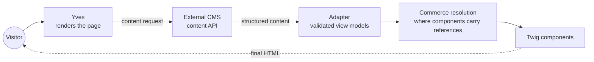
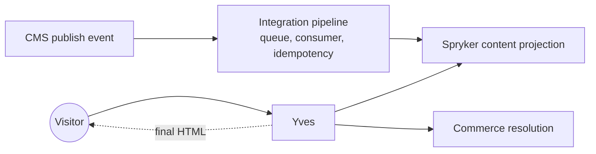
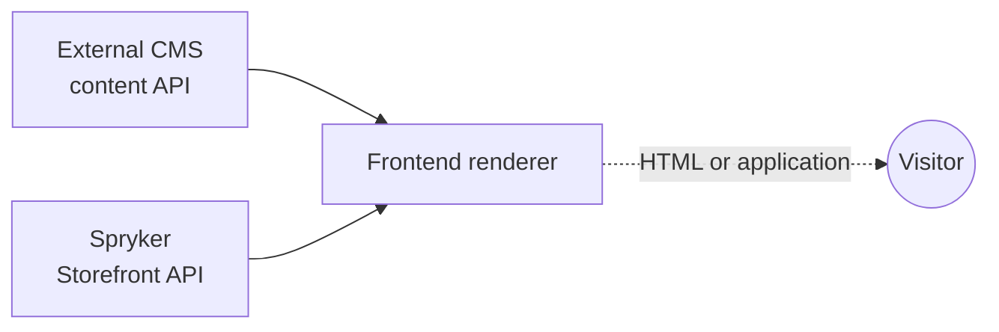
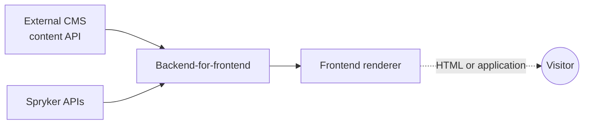
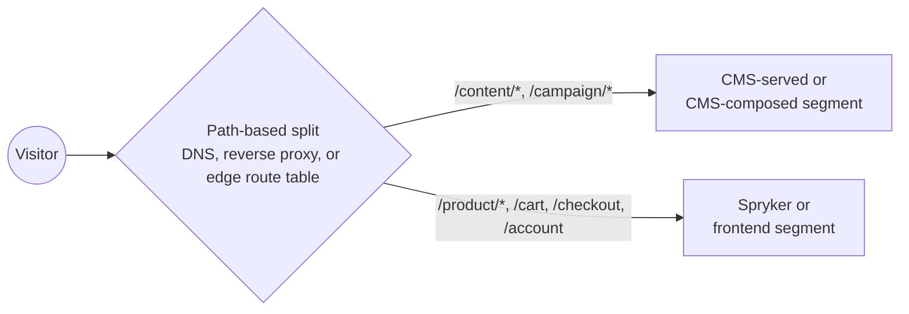
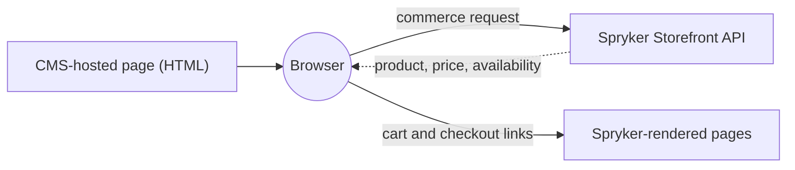
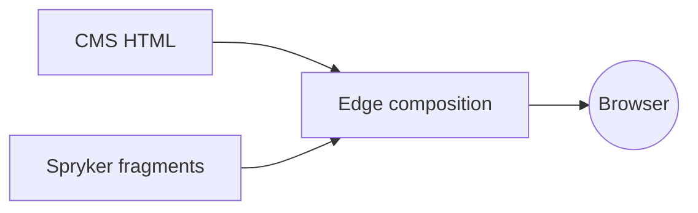

Typical situation — you are replatforming to Spryker, or starting ecommerce from scratch, and you already run a CMS with
content, editors, and workflows. This document tells you how to integrate it with Spryker, and what you have to
decide along the way.

**Your CMS does not have to change.** The integration adapts to its content model, its delivery API, its preview
   mechanism, its localization design, and its operational limits. Where your CMS and Spryker disagree, the mismatch is
   absorbed on the Spryker side, in project code. What your CMS *cannot do* eliminates strategies before preference
   does.

**Integration scope is negotiable, and staged delivery is normal.** Facing a large integration, you may reasonably
   want it delivered in stages. Scope is therefore a decision you make *inside* the chosen strategy, not a separate
   architecture, and phasing is a supported pattern rather than a compromise.

## Where this usually lands

Document below will provide a deep dive guideline, here is a glimpse of the strategies you can choose from.

**Strategy A.** Yves renders. The external CMS supplies structured content. Spryker's CMS stays installed for
commerce-coupled placement — declared content positions and content items — but is not used as an authoring surface
for editorial pages. Start narrow and widen.

**Move to Strategy B** only when you already own a frontend team and stack, or live in-context visual editing on
commerce pages is a hard requirement, or non-web channels are committed.

**Strategy C** only when an existing CMS-served site stays live and must gain commerce, or when an increment must
split the URL space.

Reason: Yves ships a complete commerce storefront — cart, checkout, customer account, B2B approval flows, quotes,
company users. Strategy A also grows scope through declared content positions with no routing split, which is what
makes a large integration deliverable in stages. Choosing strategy B means rebuilding full commerce flow in the frontend
framework, keeping the CMS integration is the smaller half of scope. 


## CMS capability assessment

What Spryker's own CMS provides is presented in the [Content Management System PBC](/docs/pbc/all/content-management-system/latest/content-management-system.html).

We expect that you can provide all the mentioned below details about your CMS. 
The more answers you have, the better choice of the integration strategy you can make.

**How Delivery of content works**

- Payload format: structured (JSON or GraphQL), presentation-ready HTML, or both.
- Whether there is a versioned content delivery API, or only a page-serving front end.
- Rate limits, quotas, and how they are enforced.
- Median and worst-case response time from the hosting region.

**How Publishing can be hooked into**

- Webhooks on publish, unpublish, delete, and asset change.

**How Preview of the content is being provided**

- A draft API, and a token that selects the draft version.
- A visual editor that renders the target storefront in an iframe, and what it requires of that storefront.
- Whether live in-context editing is offered, or only preview by reload.

## Feasibility matrix

Your CMS's capabilities state what follows when it is not supported, and what strategies that rules out. Confirm each one against
your own CMS, no common patterns or recommendations are possible here.

| Capability | If not supported | Removes |
| --- | --- | --- |
| **Structured content output** | The markup payload is forced, not chosen. Sanitization and a content-security policy become mandatory. Markup governance and channel reuse are lost by constraint, not by decision | Structured payload in A and B. [A3](#a3-payload-variant--presentation-ready-markup) and [B2](#b2-payload-variant--presentation-ready-markup) become the only options |
| **A content delivery API** | The CMS serves pages only, which makes it a renderer rather than a content source | A and B entirely. Only C remains |
| **Webhooks** | No event-driven invalidation and no event-driven projection updates. Falls back to polling plus scheduled reconciliation. The freshness target degrades and must be renegotiated in writing | Tight freshness targets in [A2](#a2-delivery-variant--synchronized-projection) and in B |
| **Rate limits and response times that fit the request path** | Reading content during the request is not viable | [A1](#a1-delivery-variant--runtime-retrieval). Also B1 wherever the frontend calls the CMS per request rather than at build time. Forces the A2 projection, or heavy caching in front of the CMS |
| **Draft access for preview — a draft API and a token** | No Spryker-side editorial preview. Either accept publish-then-look, or serve those pages from a CMS segment so the CMS's own preview applies | Preview in A and B. Pushes preview-critical content toward C |
| **Cache or CDN purge control** | Invalidation is limited to what the CMS's CDN exposes, and TTL becomes the main lever | Precise invalidation. Pushes toward the A2 projection |


## The boundaries that never move

| Responsibility | Owner |
| --- | --- |
| Editorial content, within the agreed scope | External CMS |
| Product, offer, merchant, price, and availability data | Spryker |
| Cart, customer, checkout, and order data | Spryker |
| Rendering of cart, checkout, and customer account pages | Yves or a frontend application — never the CMS |

**Why the CMS cannot render commerce.** It has no customer session and no cart state. It holds no server-side commerce
logic and no payment handling. Its output is published once and shared by every visitor.

Three consequences bind every strategy:

- cart, checkout, and account pages are always rendered by Yves or by a frontend application;
- commerce data on a CMS-served page is fetched in the browser from the Storefront API, which limits it to what a
  client-side widget can do and excludes anything needing server-side trust;
- volatile values are never authored into CMS-published HTML, because that HTML is cached and cannot track them.

## Deciding

### The three strategies

Each is a different answer to "who renders", and each suits a different starting position. Detail in
[The strategies in detail](#the-strategies-in-detail).

**A — Yves renders.** Yves owns every URL, including cart, checkout, and account. The external CMS contributes content
into pages Yves renders. Delivery variants: [A1 runtime retrieval](#a1-delivery-variant--runtime-retrieval),
[A2 synchronized projection](#a2-delivery-variant--synchronized-projection). Payload variant:
[A3 presentation-ready markup](#a3-payload-variant--presentation-ready-markup).

**B — A frontend application renders.** Spryker serves no storefront HTML and exposes commerce as APIs only. Delivery
variants: [B1 direct composition](#b1-delivery-variant--direct-composition),
[B3 backend-for-frontend](#b3-delivery-variant--backend-for-frontend). Payload variant:
[B2 presentation-ready markup](#b2-payload-variant--presentation-ready-markup).

**C — Split rendering.** Two or more renderers serve production traffic side by side, split along a stable boundary.
One of them may be the CMS serving its own pages, which is the case that cannot exist in A or B and the reason C
exists.

**Eliminate before you compare.** Run the [CMS capability assessment](#cms-capability-assessment) and the [Feasibility matrix](#feasibility-matrix) first. A
CMS with no delivery API leaves only C. A CMS with strict rate limits removes A1. A CMS with no draft API removes
Spryker-side preview. Compare only what survives.

### The strategies side by side

| | **A — Yves renders** | **B — A frontend application renders** | **C — Split rendering** |
| --- | --- | --- | --- |
| Renders the page | Yves | Frontend application | Two or more renderers, one per segment |
| Resolves routes | Spryker | Frontend application | The owner of each segment |
| Serves cart and checkout | Yves | Frontend application | Yves or the frontend — never the CMS |
| Delivery variants | A1 runtime, A2 projection | B1 direct, B3 backend-for-frontend | Per segment |
| Payload variants | Structured, or A3 markup | Structured, or B2 markup | Any, per segment |
| Composition happens in | Yves | The frontend or its backend-for-frontend | Per segment |
| Scope levels available | 1, 2, 3 | 2 or 3 — level 1 only through Glue | Per segment, but ownership stays site-wide |
| Grows in stages by | Adding declared content positions — no routing change | Route or page type | Moving one segment at a time |
| Commerce UI you get for free | All of Yves | None — you build all of it | Whatever the Spryker segment keeps |
| Layout shell | Spryker | Frontend application | One side produces it, the other replicates it |
| Preview and publishing | Built on the Spryker side | Built on the frontend side | CMS-served segments bring their own |
| Live in-context editing | No — preview by reload | Yes, where the CMS offers a bridge | Yes on CMS-served segments |
| Main strength | Fastest complete storefront, commerce proximity, cheap phasing | Independent delivery, channel reuse, best editing experience | Incremental adoption, keeps an existing site live |
| Main risk | CMS schemas coupling to storefront components | Commerce UI build cost, request fan-out, credentials exposed to the browser | Cart continuity and layout shell divergence |
| Operational cost | Lowest | Medium | Highest |

Choosing B means Spryker serves no HTML, providing data only via API, and thus everything Yves ships OOTB has to be built in the frontend framework:

- cart, checkout including payment step flows, order confirmation;
- customer account: addresses, orders, returns, wishlists, shopping lists;
- B2B surfaces where relevant: company users, business units, approval processes, quote requests, contracts, order
  budgets;
- search, filtering, product detail, and category pages;
- all forms, their validation, and their error handling.

**This is a cost question, not a feasibility one.** Current commerce resources are covered by the API, and anything
missing or shaped specifically for your project can be added with API Platform — see [Strategy B — APIs](#strategy-b--apis). Do
not rule B out on the grounds that capabilities are unreachable; they are reachable. Judge it on the fact that every
screen has to be designed, built, tested, made accessible, and maintained, while A ships those screens already.

### The decisions

| # | Decision | Options |
| --- | --- | --- |
| 1 | **Who renders the storefront** | Yves (A), a frontend application (B), two or more renderers (C) |
| 2 | **What the CMS delivers** | Structured content, or presentation-ready markup — often already settled by the CMS |
| 3 | **How content reaches the renderer** | Runtime retrieval or projection (A1, A2); direct or backend-for-frontend (B1, B3) |
| 4 | **How much the CMS owns** — the integration scope | Three levels, phased or not — see [Integration scope](#integration-scope) |

**1. Who renders.**

- **A** unless something specific forces otherwise. Fastest complete storefront, keeps commerce close, cheapest to
  run, phases cleanly through declared content positions.
- **B** when you own a frontend team and stack, when live in-context visual editing on commerce pages is a hard
  requirement, or when non-web channels are committed. Price the commerce UI before proposing it.
- **C** when an existing CMS-served site must stay live and gain commerce, or when an increment must split the URL
  space. Set an end state and, if C is transitional, an end date.

**2. What the CMS delivers.**

- Prefer **structured payload** where the CMS offers one. The renderer keeps markup, semantics, accessibility, and the
  design system, and content stays reusable across channels.
- Accept **presentation-ready markup** where the CMS produces only markup (see the [Feasibility matrix](#feasibility-matrix)), or where
  editors publishing markup without a storefront deployment is a stated requirement. Sanitization and a
  content-security policy then become mandatory, and markup governance leaves the storefront codebase.
- **Never mix the two in one content location.** Decide per location which payload it accepts, so sanitization rules
  are unambiguous.

**3. How content reaches the renderer.**

- Prefer the **projection** (A2) over runtime retrieval when resilience or predictable response time matters more than
  freshness, and whenever the [Feasibility matrix](#feasibility-matrix) flags rate limits or slow responses.
- Prefer a **backend-for-frontend** (B3) when direct composition causes too many calls, when tokens must stay
  server-side, or when context mapping would otherwise be duplicated across frontends.

### The visual editing question

This requirement decides A versus B more often than any other, and it is usually assumed rather than specified.
Establish it explicitly.

| Capability | Yves (A) | Frontend application (B) | CMS-served segment (C) |
| --- | --- | --- | --- |
| Preview draft content in storefront context | Yes — a protected preview route, embeddable in an iframe | Yes | Yes, natively |
| Live patching as the editor types | **No** — preview is by reload | Yes, where the CMS offers a bridge | Yes, natively |
| Click a rendered component, the CMS opens that field | Limited | Yes | Yes |
| The editor sees real commerce data in preview | Yes | Yes | Client-side only |

If your marketing team saw the middle two rows in a CMS demo and expects them on commerce pages, that is a genuine
trigger for B — or for placing those specific pages in a CMS-served segment under C. Settle it during discovery, not
during acceptance testing.

### Integration scope

Scope is not a strategy. It is decided **inside** the chosen strategy, recorded per content type, and allowed to grow.

Spryker's own CMS is not displaced by an external CMS. Declared content positions, reusable blocks with validity dates
and category or product assignment, typed content items that reference commerce entities, and the asynchronous publish
and synchronize pipeline are **placement and publishing machinery** that external content flows through. How much of
it remains an *authoring surface* is what the scope decision settles.

#### Scope levels

| Level | The external CMS owns | Spryker's CMS role | Back Office content role |
| --- | --- | --- | --- |
| **1 — Editorial surfaces** | Campaign, brand, editorial, and landing pages in a defined URL space | Authoring surface for commerce-page content: declared content positions, blocks, content items | Retained for commerce-coupled content |
| **2 — Editorial plus placement** | Level 1, plus content supplied into Spryker-owned page types through declared content positions | **Placement and publishing machinery only** — positions, validity, projection — not an authoring surface | Configuration only, no content authoring |
| **3 — Full** | All authored content, site-wide | Optional projection target and rendering infrastructure | None |

Level 2 is the usual target for Strategy A. Level 3 is the usual outcome of Strategy B, because Yves is retired and
placement through declared content positions is unreachable.

#### What happens to each Spryker CMS entity

The scope level states intent. This table states what it means per entity. Fill it in for the project — the answers
are not uniform, and "we chose level 2" does not by itself say what becomes of blocks.

| Entity | Level 1 | Level 2 | Level 3 |
| --- | --- | --- | --- |
| **CMS pages** (`Cms`, `CmsStorage`) | Authored in the Back Office for service, legal, and commerce-owned pages | Not authored — the external CMS owns page-level editorial content. Pages may still exist for anything nobody moved | Not an authoring surface. A projection target only if that was chosen |
| **CMS blocks** (`CmsBlock`) | Authored in the Back Office. Reusable fragments with their own templates, validity dates, and category or product assignment | **Two valid designs — pick one per content type**, see below | Unused, or a projection target |
| **Declared content positions** (`CmsSlot`, `CmsSlotBlock`) | Declared in templates, blocks assigned to them in the Back Office | **Retained as the placement mechanism** — declarations, conditions, visibility resolvers — now fed from the external CMS | Retained wherever Yves still renders. Unreachable in Strategy B |
| **Content items** (`Content*`, `ContentStorage`) | Authored in the Back Office. The mechanism for referencing products, categories, and product sets from content | Kept wherever commerce coupling matters. Otherwise re-expressed as external CMS component types that carry references | Unused. Commerce references live in external CMS component types and resolve at render time |

#### The blocks decision at level 2

Once the external CMS supplies content into declared positions, blocks can go two ways, and the choice is not
cosmetic.

- **Bypass them.** `CmsSlotContentPluginInterface` supplies position content directly and `CmsBlock` plays no part.
  Simplest. The external CMS then owns everything about that content, scheduling included — so it must support
  scheduling.
- **Keep them as the projection target.** External content is written into `CmsBlock` entities, so validity dates,
  category and product assignment, publishing state, and Back Office visibility keep working. Costs a synchronization
  pipeline, and an editorial workflow in which publishing in the external CMS is not the last step.

Keep blocks when the *placement rules* are commerce-aware — a block that appears only on certain categories, or only
between two dates — and the external CMS has no equivalent. Bypass them when placement is simple and the external CMS
already governs scheduling. Deciding per content type is fine. Deciding per page is the failure this section exists to
prevent.

**Exactly one system owns each content type, site-wide.** Two systems authoring one content type produces diverging
copies and editors who cannot tell which tool is authoritative. This holds at every scope level, in every strategy,
and at every phase of a staged rollout. Everything else is scope; this is the constraint.

#### What each strategy must decide about scope

- Which page types the external CMS supplies.
- Which content locations inside Spryker-owned page types.
- Whether navigation, header, footer, and legal content are in scope.
- What Spryker's CMS retains — authoring surface, placement machinery only, or nothing.
- Which part of the URL space the external CMS owns.

### Where personalization changes the answer

Personalization interacts badly with the caching models this document recommends. Decide early. A personalization
requirement discovered after a caching strategy is built usually invalidates that strategy.

| Model | Consequence |
| --- | --- |
| **None** | Shared caches work as described |
| **Segment-based, few segments** | The segment enters the cache key. Keep the segment count small and derivable server-side; each dimension multiplies entries and dilutes the hit rate |
| **Individual** | The response cannot be shared. Render the personalized region client-side over a cached shell, or take that region out of shared caches entirely. Never let a personalized response into a CDN |
| **A/B testing in the CMS** | The variant identifier must reach both the cache key and analytics. If the CMS assigns variants at its own edge and Spryker caches the result, visitors see variants flip. Prefer assigning variants on the rendering side |

### Decision tree

1. Can the CMS deliver content through an API at all?

   ```text
   ├─ no  → it is a renderer, not a source → Strategy C only
   └─ yes → continue
   ```

2. Who renders the storefront?

   ```text
   ├─ Yves — the default for replatform and greenfield
   │    └─ Strategy A
   │         ├─ Delivery: rate limits, slow responses, or a resilience requirement?
   │         │    ├─ yes → A2, synchronized projection
   │         │    │         └─ Projection target:
   │         │    │              ├─ placement or Back Office tooling wanted
   │         │    │              │   → Spryker CMS entities
   │         │    │              └─ faithful mapping of their structures
   │         │    │                  → dedicated storage
   │         │    └─ no  → A1, runtime retrieval behind a mandatory cache
   │         ├─ Payload: does the CMS emit structured content?
   │         │    ├─ yes → structured payload
   │         │    └─ no  → A3, markup in named content locations, sanitized
   │         └─ Scope: level 1, 2, or 3 — and the phase plan
   │
   ├─ A frontend application — you own the stack, or live visual editing is required
   │    └─ Strategy B — first confirm the cost in 3.4
   │         ├─ Delivery: does direct composition cause too many calls
   │         │  or leak backend concerns?
   │         │    ├─ yes → B3, backend-for-frontend
   │         │    └─ no  → B1, direct composition
   │         ├─ Payload: structured, or B2 markup in named regions
   │         └─ Scope: level 2 or 3; level 1 only through Glue
   │
   └─ Two or more renderers must serve production traffic
        └─ Strategy C — only with a segment map defined up front
             ├─ Is an existing CMS-served site staying live?    → yes, C is the target
             ├─ Is this a step on the way to A or B?            → set the end state and end date
             ├─ Is there a stable split boundary — route, page type, store, market?
             │    └─ no → do not choose C; decide a single renderer first
             └─ Cart, checkout, account → always a Spryker or frontend segment

   ```

## The strategies in detail

### Strategy A — Yves renders

#### A: Definition

Yves owns the storefront request and produces the final HTML. Every URL, cart, checkout, and account included, is
resolved by Yves. The external CMS contributes content into pages Yves renders.

The preferred payload is **structured editorial data**: the CMS response describes a page and its component instances,
while Twig templates, styling, behavior, and commerce-data resolution stay in the Spryker storefront. Where the CMS
emits only markup, [A3](#a3-payload-variant--presentation-ready-markup) applies instead.

Page composition is a choice *within* this strategy:

- **CMS-composed pages** — the CMS defines the page and the order of its component instances, and Yves renders that
  structure. Gives editors freedom at page level.
- **Spryker-composed pages** — Spryker owns the page type, the template, and the content locations, and the CMS
  supplies content into them. Keeps Spryker page types authoritative. The usual choice for category and product pages.

The mapping from CMS component types to storefront components lives in project code. Neither the CMS nor Spryker core
owns it, which makes it **the main integration artifact** — and, because your CMS stays as it is, the place where
every model difference lands ([Adapting to a fixed content model](#adapting-to-a-fixed-content-model)).

#### A: Contract

| Responsibility | Owner |
| --- | --- |
| Editorial content, within scope | External CMS |
| Page type, template, and content locations | Spryker |
| Page-level composition | External CMS *or* Spryker |
| Route resolution, URLs, and redirects | Spryker |
| Navigation structure | External CMS *or* Spryker |
| Layout shell, header and footer included | Spryker |
| Component rendering, styling, and behavior | Spryker |
| Markup sanitization and content-security policy | Spryker |
| Product, offer, merchant, price, and availability data | Spryker |
| Cart, customer, checkout, and order data | Spryker |

Yves resolves every route, so the CMS never performs route resolution here. Slugs may originate in the CMS and be
consumed by Yves as content — which is different from owning resolution.



#### A1. Delivery variant — runtime retrieval

Yves retrieves structured content during the storefront request, maps it to view models, resolves commerce references,
and renders Twig components.

Requires a connection that is consistently fast. Derive the acceptable CMS response time from the page latency budget:
the CMS call is one serial step inside it, alongside commerce resolution and rendering. If it cannot fit its share, it
needs a cache in front of it, or the A2 projection.

Define connection and response timeouts, failure handling, and behavior when content is temporarily unavailable.
**Caching is mandatory in production.** Derive its duration and its invalidation from request rate, change rate, the
acceptable delay before a change becomes visible, and the staleness you accept during a CMS outage.

**Main advantage:** near-live delivery, with no synchronization pipeline.

**Blocked when** the [Feasibility matrix](#feasibility-matrix) flags rate limits or unpredictable response times.

#### A2. Delivery variant — synchronized projection

Content is imported into a Spryker **content projection** after publishing. Yves reads the projection.

Projection target:

- **Spryker CMS entities** — keeps Back Office tooling, placement, and publishing state usable, at the cost of fitting
  the CMS's structures into Spryker's;
- **dedicated storage** — project-owned, shaped after the CMS's component contract. Faithful, but reuses none of the
  Spryker CMS tooling.



This takes the CMS call off the request path and gives predictable response times. A CMS outage does not interrupt
requests while synchronized content is available. Failures move into the pipeline, so define retry behavior,
idempotent processing, dead-letter handling, monitoring, and periodic reconciliation.

**Where webhooks are not supported** (see the [Feasibility matrix](#feasibility-matrix)), the pipeline runs on polling plus scheduled
reconciliation, and the freshness target must be renegotiated explicitly.

**Behavior on a projection miss.** Decide it explicitly; it is part of the design, not an implementation detail. The
production default is that the projection is authoritative — a miss is a not-found, not a reason to call the CMS. A
live read-through fallback is convenient in development, but as a production default it destroys the property that
justified A2:

- a broken pipeline stops being visible. The site works until the CMS is also down, and then both fail together;
- a cold or mass-invalidated projection turns every request into an upstream call, exactly where rate limits and slow
  responses appear;
- the same URL serves projected or live content depending on hit or miss, and whichever arrives first is what
  downstream caches keep.

If a production fallback is required anyway, bound it: one in-flight request per key, a concurrency ceiling, a circuit
breaker, a write-back into the projection, and a miss rate alarmed as a defect. Keep production and non-production
behavior aligned so live code exercises the fallback path.

**Main advantage:** predictable performance and resilience. **Trade-off:** updates are not immediate. Visibility
depends on event delivery, processing, the projection write, and any cache above it. Measure synchronization lag as an
explicit freshness target.

#### A3. Payload variant — presentation-ready markup

Yves owns the request and the surrounding page, and embeds CMS-returned HTML into declared content locations —
typically through CMS templates and declared content positions. Combines with either delivery variant.

There is no component mapping here. The integration artifact is the **embedding contract**: where CMS HTML may appear,
which markup is permitted, and how it is sanitized.

Suits campaign and editorial fragments from an editorial or agency team, and content short-lived enough that governed
components are not justified. It applies on commerce pages too: a Yves-rendered cart page can embed a trust badge or a
campaign strip while Spryker keeps the cart, the session, and all commerce behavior.

Trade-off: presentation, accessibility, and design-system rules move outside the Spryker codebase. Define explicitly:

- allowed markup, sanitization rules, and content-security policy;
- whether embedded scripts are permitted at all — default no;
- fragment boundaries, and which content locations accept markup;
- behavior when a fragment is unavailable or malformed;
- how markup changes are validated before publishing, since they can break the storefront with no Spryker deployment.

Where the [Feasibility matrix](#feasibility-matrix) shows the CMS emits only HTML, this is not a choice. It is the design, and the
trade-offs above are constraints to communicate rather than decisions to make.

#### A: Integration scope

All three levels are available, because Yves renders and all Spryker CMS machinery stays reachable.

| Level | Shape in Strategy A |
| --- | --- |
| **1** | The CMS owns a defined editorial URL space. Spryker's CMS keeps declared content positions, blocks, and content items as an authoring surface for commerce pages. Cheapest start, and two authoring tools split strictly by content type |
| **2** | The CMS additionally supplies content into Spryker-owned page types through `CmsSlotContentPluginInterface`. Spryker's CMS becomes placement machinery — position declarations, conditions, validity — without being authored in. **Usual target** |
| **3** | The CMS owns everything authored. Spryker CMS entities are used only as a projection target, if at all. The Back Office has no content role — enforce that with ACL, not documentation |

Decide additionally: whether navigation is authored in the CMS or stays in Spryker (`ContentNavigation`, the category
tree); who owns header, footer, and legal content; and what happens to content already seeded into Spryker's CMS
during implementation.

#### A: Growing in stages

Strategy A phases more cheaply than any other option, and that is a principal reason to choose it for a large
integration.

- **Widen by content location.** Positions are declared in templates once. Each new location is a plugin registration
  and a component mapping, with no routing change, no second renderer, and no cutover event.
- **Widen by content type.** Move one content type at a time from Spryker's CMS to the external CMS, updating the
  ownership register at each step. Each move completes — editor training included — before the next begins.
- **Widen by page type.** Editorial pages first, then commerce-adjacent locations, then level 3 if wanted.

No phase may leave a content type owned by two systems.

#### A: Fits when

- A replatform or greenfield build, where Yves is the fastest route to a complete storefront.
- B2B commerce, where approval flows, quotes, and company-user surfaces are expensive to rebuild.
- Commerce-heavy pages where editorial content enriches Spryker-owned page types.
- Projects where the design system must control component rendering and behavior.
- Large integration scopes that must be delivered in phases.
- Structured editorial content that should stay reusable across channels.

#### A: Main design decisions

- Payload model, and which content locations may accept presentation-ready markup.
- Delivery variant, and for A2 the projection target and the projection-miss behavior.
- Scope level, and the phase plan.
- Component contract mapping, its versioning, its allow-list, and unknown-type behavior.
- Adapter boundary, and how model differences are absorbed
  ([Adapting to a fixed content model](#adapting-to-a-fixed-content-model)).
- Commerce-reference resolution, batching, and missing-entity behavior.
- Cache boundaries between editorial content and dynamic commerce data.
- Preview route, its authorization, publication state, and cache isolation.
- Locale, store, currency, URL, and marketplace context handling.
- Ownership of component rendering, accessibility, SEO metadata, and analytics.

#### A: Risks to cover

- Tight coupling between CMS schemas and storefront components — and the schemas can change without notice.
- Unsupported or obsolete component types causing pages to render incompletely.
- Too many commerce lookups from resolving references component by component.
- Inconsistent store, locale, currency, or marketplace context between content and commerce.
- Cache entries mixing editorial content with volatile or customer-specific data.
- Draft content leaking into published routes or shared caches.
- Vendor payloads reaching Twig without validation or adaptation.
- Unclear ownership of URLs, SEO metadata, analytics, accessibility, or component behavior.
- Editors going back to the Back Office for content the external CMS now owns, at levels 2 and 3.
- *With A3:* untrusted markup or scripts reaching the page, cross-site scripting included.
- *With A3:* presentation and accessibility rules bypassing the design system.

### Strategy B — a frontend application renders

#### B: Definition

A decoupled frontend application owns routing, page composition, and rendering. Spryker serves no storefront HTML and
exposes commerce capabilities as APIs only.

The frontend reads editorial content from the external CMS, and commerce data from the **Storefront API** for anything
carrying customer, cart, or session context. **Backend APIs** serve trusted server-side calls from a
backend-for-frontend or a build step, never from a browser.

Content does not have to reach the frontend directly from the CMS. It may also be served by Spryker, or referenced
from commerce resources. The three options and when each is justified are in [Strategy B — APIs](#strategy-b--apis).

**Before proposing this strategy, price the commerce UI.** Every screen Yves ships is built here instead: cart,
checkout including its payment steps, order confirmation, customer account, and the B2B surfaces — company users,
approval flows, quote requests, contracts. The CMS integration is the smaller half of that program. This is a cost
argument, not a feasibility one: the commerce capabilities are all reachable over the APIs.

#### B: Contract

| Responsibility | Owner |
| --- | --- |
| Editorial content, within scope | External CMS |
| Page type, template, and content locations | Frontend application |
| Page-level composition | External CMS *or* frontend application |
| Route resolution, URLs, and redirects | Frontend application |
| Navigation structure | External CMS *or* Spryker through Glue — see the note |
| Layout shell, header and footer included | Frontend application |
| Component rendering, styling, and behavior | Frontend application |
| Markup sanitization and content-security policy | Frontend application |
| Product, offer, merchant, price, and availability data | Spryker |
| Cart, customer, checkout, and order data | Spryker |

**Note on navigation.** Yves is retired, so "Spryker owns navigation" can only mean navigation is authored in Spryker —
the category tree, or `ContentNavigation` items — and consumed over Glue. If nobody will maintain a Back Office
navigation surface once Yves is gone, the honest answer is that the external CMS owns navigation. Decide it
explicitly rather than inheriting it.

#### B1. Delivery variant — direct composition

The frontend reads CMS content and Spryker data independently and combines them during server-side rendering, static
generation, incremental regeneration, or client rendering.



#### B3. Delivery variant — backend-for-frontend

A backend-for-frontend resolves CMS references, requests the Spryker resources it needs, normalizes the response, and
exposes a contract shaped for one frontend.



Worth its own deployment when direct composition causes too many calls, when tokens must stay server-side, or when
context mapping is complex enough that several frontends would otherwise duplicate it.

#### B2. Payload variant — presentation-ready markup

The frontend places CMS-returned HTML into declared regions of its own layout instead of mapping structured
components. Same sanitization, content-security policy, and design-system trade-offs as
[A3](#a3-payload-variant--presentation-ready-markup). Combines with B1 or B3.

#### B: Integration scope

Scope narrows because Yves does not render: Twig templates and placement through declared content positions are
unreachable, and Spryker CMS content is consumable only through Glue, like any other source.

| Level | Shape in Strategy B |
| --- | --- |
| **1** | Only through Glue-exposed Spryker CMS content, treated as a second content source with an explicit precedence rule per content type. Rarely worth the complexity |
| **2** | The frontend composes CMS content into its own page types. Spryker's CMS supplies commerce-coupled content items over Glue where that coupling matters |
| **3** | **Usual outcome.** The external CMS is the single editorial source, and Spryker's CMS is retired as an authoring surface |

Confirm before choosing this strategy that **no team depends on Back Office content editing.** That dependency is easy
to overlook until after the decision.

#### B: Growing in stages

Phasing is by route or page type, executed as [Strategy C](#strategy-c--split-rendering) with an end state. There is
no cheap in-place widening equivalent to A's declared content positions. If you need staged delivery and B is the
target, budget for a period of running two renderers.

#### B: Fits when

- You already own a frontend stack and the team to run it.
- Live in-context visual editing on commerce pages is a hard requirement.
- Several channels share the same commerce APIs.
- Editorial experiences where freedom at page level dominates.
- Teams that need an independent frontend release cadence.

#### B: Main design decisions

- Payload model, and which regions accept presentation-ready markup.
- Direct API access versus a backend-for-frontend.
- The API contract shape each frontend surface needs, and which of it is existing resources versus new API Platform
  resources ([Strategy B — APIs](#strategy-b--apis)).
- API granularity and request fan-out.
- Server-side versus client-side commerce requests.
- Authentication and token boundaries.
- Cache separation between editorial and transactional data.
- Preview-mode routing.
- Publishing model: what a publish event must reach — the frontend's cache or CDN, the backend-for-frontend cache, and
  a rebuild or on-demand revalidation for statically generated pages.
- Freshness target, measured from publish to visible. With static generation this depends on build or revalidation
  time, not on cache expiry.
- Unpublish and delete behavior, including what a generated page shows once its source is gone.
- Degradation behavior if either upstream is unavailable.
- Navigation ownership once Yves is retired.

#### B: Risks to cover

- Commerce UI build cost underestimated at planning time.
- Project-shaped API resources treated as free. They are cheap to add with API Platform, but they still need
  designing, versioning, and maintaining.
- Browser-visible secrets, or backend credentials in client code.
- Excessive request fan-out from the frontend.
- Inconsistent locale and store context between the CMS and Spryker.
- Stale product or offer information baked into generated pages.
- Duplicated URL and navigation logic.
- Internal Spryker data models exposed as UI contracts.
- *With B2:* untrusted markup or scripts reaching the page.
- *With B2:* presentation and accessibility rules bypassing the design system.

### Strategy C — split rendering

#### C: Definition

Two or more renderers operate side by side, with rendering ownership divided along a stable boundary — route, page
type, store, or market. A renderer here is Yves, a frontend application, **or the external CMS serving its own pages**.
That last case cannot occur in A or B, and it is why this strategy exists.

The URL space is split by path, and each segment owner owns the redirects inside its segment. Commerce paths — cart,
checkout, account — always belong to a Spryker-rendered or frontend-rendered segment.



Two patterns arise specifically from CMS-side rendering, and neither delivers a complete storefront on its own.

**CMS-hosted content pages.** The CMS serves its own paths and Spryker keeps the commerce paths. Commerce data on those
pages loads in the browser from the Storefront API, so interactive commerce is limited to what a client-side widget can
do, and anything stateful is a handoff.



**Edge composition.** An edge layer holds the route table and assembles responses from CMS HTML and Spryker-rendered
fragments.



**Two distinct reasons to be here**, and they must not be confused.

1. **Target architecture** — the CMS already serves a live marketing site that stays. This is a permanent design.
2. **A step on the way to A or B** — which needs an end state and an end date, or it becomes permanent by default and
   carries the highest operational cost of the three.

#### C: Contract

Ownership is assigned *per segment*, never shared within one. The contract is the segment map plus, for each segment,
the contract of the strategy that owns it.

| Responsibility | Owner |
| --- | --- |
| Segment map — which renderer owns which path | The team operating the routing layer: edge, reverse proxy, or DNS. Name it explicitly |
| Editorial content, within scope | External CMS |
| Page type, template, and content locations | External CMS, Spryker, or frontend application |
| Page-level composition | External CMS, Spryker, or frontend application |
| Route resolution, URLs, and redirects | External CMS, Spryker, or frontend application |
| Navigation structure | External CMS or Spryker |
| Layout shell, header and footer included | Spryker or frontend application |
| Component rendering, styling, and behavior | External CMS, Spryker, or frontend application |
| Markup sanitization and content-security policy | External CMS, Spryker, or frontend application |
| Product, offer, merchant, price, and availability data | Spryker |
| Cart, customer, checkout, and order data | Spryker |

**The layout shell causes the most trouble.** It is always produced by Spryker or the frontend, never authored in the
CMS, but it must appear identically on CMS-served pages. Define how it is replicated: a shared fragment the CMS
consumes, a duplicated implementation with a written synchronization discipline, or a shell injected at the edge.

**Session and cart continuity** needs the same explicit treatment. It is the only failure here that silently loses a
customer's cart: a visitor on a CMS-served page adds an item through the Storefront API with the cart token in the
browser, then navigates to a Spryker-rendered `/cart`, and Spryker must resolve the same cart — from the session, or
from an explicit token handoff.

#### C: What the external CMS keeps

For a segment the CMS serves itself, preview, caching, and publishing are its own concerns and need no Spryker-side
equivalent. Its editor previews its drafts, its CDN caches its pages, its workflow governs when they go live. A real
advantage, and the reason C is sometimes right even when A is cheaper.

Three things do not transfer:

- **shared content** rendered in more than one segment — header and footer, navigation, legal text, campaign banners.
  One publish event then has several invalidation targets, and partial success leaves segments disagreeing;
- **the edge cache** in the edge-composition variant, which belongs to neither system and has no owner by default;
- **preview of content that lands in a Spryker- or frontend-rendered segment**, because the CMS cannot render those
  pages.

#### C: Integration scope

Each segment can technically take a different scope level, and that freedom is the trap. **Assign each content type
one owner across the whole site, not per segment.** Two consequences:

- content shared across segments must have a single owner and a defined route into every segment that renders it;
- if a Yves-rendered segment keeps Spryker's CMS for position content, that must not extend to content types that also
  appear in CMS-served segments.

#### C: Growing in stages

C *is* the vehicle when an increment must split the URL space. It requires:

- a target strategy and an end date;
- a migration order, per content type;
- a standing check that the segment map matches deployed routing;
- both sides deployed and serving throughout, so rollback is a routing change.

#### C: Fits when

- An existing CMS-served marketing site stays live and must gain commerce.
- Content-led sites where editorial dominates and commerce is the smaller surface.
- Increments toward A or B that must split the URL space — with an end date.
- Store- or market-specific rendering models.
- Cases where the [Feasibility matrix](#feasibility-matrix) shows the CMS has no delivery API at all.

#### C: Main design decisions

- URL ownership per path, recorded in the segment map.
- Shared header, footer, and navigation, and how they are replicated.
- Session and identity propagation across the boundary.
- Store, locale, currency, and market mapping, agreed on both sides — a visitor crosses segments within one session.
  Where the boundary *is* store or market, the segment map and the store map are the same artifact.
- Invalidation of shared content, and the owner of the edge cache.
- Preview routes on the rendering side, for content in segments the CMS does not serve.
- SEO metadata and canonical URLs — exactly one claimant per URL.
- Analytics continuity.
- Error handling across applications.
- Deployment and rollback boundaries.

The segment map is a **prerequisite**, not an outcome.

#### C: Risks to cover

- Session, cart, or authentication continuity breaking at the boundary.
- The layout shell diverging because each side deploys on its own cycle.
- SEO metadata and canonical URLs conflicting across renderers.
- Injected scripts on a CMS-served page reaching Spryker session cookies or the Storefront API, because both segments
  share one origin.
- Storefront API tokens in browser code granting more scope than a widget needs.
- Volatile commerce values authored into cached CMS-served HTML.
- Analytics discontinuity across a split funnel.
- The segment map drifting away from deployed routing.
- An increment becoming permanent because no end date was set.

---

## Adapting to a fixed content model

Your CMS stays as it is. This integration does not prescribe its component schema, its field naming, or its
localization design. You assess what exists, map it, and absorb the difference in the adapter. This is the daily work
of the integration.

### Assess before mapping

Produce a content-model assessment alongside the [CMS capability assessment](#cms-capability-assessment):

- an inventory of component and content types, and which are actually used rather than merely defined;
- for each type: fields, field types, nesting, required versus optional, and whether it carries presentation values;
- which types are in scope at each phase;
- how commerce entities are referenced today — a picker field, a plain text SKU, a URL, or not at all;
- how localization works, and whether locale identifiers map onto Spryker stores;
- versioning, and how schemas have changed in the past;
- who may change schemas, and whether you get notified.

That last point is a real risk, not an administrative detail. The schema can change with no Spryker deployment, and
the integration must fail safely when it does.

### Model differences and how to absorb them

| Their model | Absorb by |
| --- | --- |
| **Flat fields, no component tree** | The adapter synthesizes structure: a fixed page template per content type, with fields mapped to declared content locations. Editors keep the model they know; freedom at page level is simply not available |
| **Free-form rich text as the main field** | Treat it as a markup payload ([A3](#a3-payload-variant--presentation-ready-markup)) with sanitization, even if the CMS is nominally headless. Do not try to parse HTML into components |
| **Presentation values mixed into content** — `cssClass`, `marginTop`, `columnWidth` | The adapter maps a bounded set to design-system tokens and **drops the rest**. Never pass through arbitrary class or style values. Record which values are honored, so editors are not guessing |
| **One "flexible" component with a `variant` field** | Fan it out in the adapter into distinct view models, one per variant. Branching stays in mapping code, never in templates |
| **Copied commerce values** — price, stock, "was" prices | Ignore them at the adapter boundary and resolve from Spryker. Add a check at publish or import time that flags copied values and reports them to the content owner. Do not render them silently |
| **No schema versioning** | The adapter validates strictly and rejects unknown shapes rather than passing them through. Contract tests pinned to recorded payloads detect drift |
| **Unbounded nesting** | Enforce a declared maximum depth in the adapter, with recursive validation. Unbounded nesting is a denial-of-service surface and a rendering-cost surprise |
| **Locale as a folder or slug convention** | An explicit mapping table in project configuration, not string parsing at render time |
| **Identifiers that are not stable** — positional, or renameable | Agree a stable key with the content owner, or key on the CMS's internal identifier and accept that renames are invisible. Record which one you chose |

The general rule: **the adapter is the deliverable**, not a translation detail. It is where your content model and
the storefront's requirements are reconciled, and it is tested as a contract.

---

## Cross-cutting concerns

These apply to every strategy. Each needs one named owner and a recorded answer. Where a strategy narrows a concern,
the narrowing is noted.

### Localization and store context

Map explicitly between: Spryker store; locale and language; currency; country or market; the CMS's own dimension
(space, folder, or field-level translation); and marketplace merchant context where it applies.

The mapping is a first-class artifact, not a convention — and since your CMS stays as it is, it is a Spryker-side
table in project configuration. Both sides must agree, because a visitor crosses pages within one session and expects
consistent language, currency, and market. In Strategy C, where the segment boundary *is* store or market, the segment
map and the store map are the same artifact.

Define the fallback when a locale has no content: fall back to a default locale, hide the component, or fail the page.
The answer differs per content type and must be recorded.

### URLs and routing

Assign ownership of: slugs; route resolution; redirects; canonical URLs; hreflang links; preview URLs; and the
behavior of deleted and unpublished content.

Two systems resolving one URL, or emitting different canonical URLs for one page, is an SEO defect that surfaces weeks
later. Exactly one system claims each URL.

### Preview

Preview and published delivery are separate paths that happen to render the same components. Keep them separate end to
end:

- draft versus published delivery, and which credential or token selects each;
- preview authorization, so drafts are reachable only by authorized editors;
- **cache isolation** — a preview response never enters a shared or public cache. This is the most common preview
  defect;
- iframe requirements where a visual editor renders the target storefront, including the `frame-ancestors` directive
  and HTTPS;
- live commerce data in preview, plus editor-friendly placeholders for missing or unpublished entities;
- which contexts are previewable — store, locale, currency, market, merchant — and the explicit decision that
  customer-specific context is not.

**Where draft access is not available** (see the [Feasibility matrix](#feasibility-matrix)), Spryker-side preview is not possible. Options:
accept publish-then-look; stage content in a non-production space; or serve preview-critical pages from a CMS segment.
Decide it and communicate it. Do not leave it to be discovered.

**Narrowing:** a CMS-served segment in C brings its own preview. Spryker- and frontend-rendered pages need preview
built on the rendering side.

### Publishing

The path from an editorial action to visible content. Define:

- publication state and scheduled activation, **including which system evaluates the schedule**. A schedule held in
  the CMS but rendered from a projection needs the projection updated at activation time, not at publish time;
- publish, unpublish, and delete events, and what each does to content already delivered;
- **every target a publish event must reach** — content caches, projections, generated pages, search indexes, CDN,
  edge cache. Enumerate them. A target found later is a stale-content incident;
- event authenticity, deduplication, ordering, retries, and dead-letter handling;
- **reconciliation**, because webhook delivery is not guaranteed and drift accumulates silently — and because the CMS
  may have no webhooks at all;
- the **freshness target** as a number, measured from publish to visible, with monitoring that detects a miss.

**Deriving the freshness target.** There is no default. Budget each stage, sum them, then measure the result and
replace the estimates.

```text
CMS publish event emitted
  → webhook delivery time         CMS-side; a poll interval instead, where webhooks are not supported
  → queue wait                    worker cadence — a project decision
  → consumer processing           payload size, validation, commerce resolution
  → projection write
  → publish and synchronize to storage
  → any cache TTL above the projection
= visible to a visitor
```

Two things to state up front: the stages belong to different systems, so no single team can commit to the total
alone; and the last stage is usually the largest and the easiest to shorten.

### Assets and media

- **Who serves images** — the CMS's asset CDN or Spryker's. The CMS's is usually right for editorial imagery and keeps
  its transformation features available.
- **Transformation and responsive variants** — which system produces which sizes and formats.
- **Alt text ownership.** Alt text is editorial content, so it lives in the CMS beside the image and must survive the
  adapter into rendered markup. Accessibility lost in mapping is a common finding.
- **Invalidation.** Replacing an image behind a stable URL needs a purge. Content-hashed URLs avoid this and are
  preferred.
- **Origin and content-security policy.** A second asset origin enters the policy, and the consent model if it sets
  cookies.
- **Delete behavior** — what a published page renders when its asset is gone.

### Search

Decide whether external CMS content is findable in storefront site search.

- **Not indexed** — products only. Simplest. State it, so it is not discovered as a gap at launch.
- **Indexed into Spryker's index** — content projected and indexed alongside `CmsPageSearch` output, so one search box
  covers everything. Needs a projection or a dedicated indexing pipeline, plus removal on unpublish and delete.
- **Federated** — the frontend queries both and merges. Only reasonable in B, and ranking across two engines is a real
  problem, not a detail.

Whichever you choose, unpublish and delete must remove content from the index, and reconciliation must detect index
drift.

---

## Where the work lands in Spryker

This part targets the current Spryker version. Module contents, plugin names, and dependency-provider registrations
still differ by project, because `Pyz` may override or replace what core provides. Confirm every name against the
project's own `src/` and its installed vendor modules before you plan against them.

### Work by layer

| Layer | Responsibility |
| --- | --- |
| **Client** | The CMS HTTP client and the adapter; reading the content projection from Redis through `Storage`. Nothing renders here |
| **Yves** | Routing, controllers, view models, Twig components, widgets, content-position content, preview routes |
| **Zed** | Webhook receipt, queue consumption, projection write, publish and synchronize wiring, Back Office extensions |
| **Glue** | Exposing commerce and content resources to a frontend application or a backend-for-frontend |
| **Shared** | Transfers, constants, Twig plugin registration |
| **Service** | Sanitization and stateless helpers |

### Strategy A — Yves

**Content retrieval, Client layer, project module** — for example `Pyz\Client\ExternalCms`.

- A dedicated client module with a factory-provided HTTP adapter that isolates the vendor response shape. This is the
  adapter described in [Adapting to a fixed content model](#adapting-to-a-fixed-content-model).
- Configuration through the module `Config` plus environment-specific `config_*.php`. Tokens come from environment
  variables and are never committed.
- Timeouts, retries, and circuit breaking on the HTTP client, derived from the page latency budget.

**Routing.**

- `Spryker\Yves\RouterExtension\Dependency\Plugin\RouteProviderPluginInterface`, registered in
  `Pyz\Yves\Router\RouterDependencyProvider`, for static routes.
- `RouterPluginInterface` and `RouterEnhancerPluginInterface`, same namespace, for catch-all CMS slugs resolved at
  request time. The existing `UrlStorage`-backed router is the established pattern for URLs resolved from storage.

**Rendering.**

- A controller extending the project's Yves `AbstractController`, resolving the payload through the client and passing
  **validated view models** — never raw vendor arrays — to Twig.
- A component resolver or registry mapping CMS component types to Twig templates, carrying an allow-list of supported
  types and the behavior for anything outside it.
- Reusable rendering units as widgets extending `Spryker\Yves\Kernel\Widget\AbstractWidget`, registered in
  `ShopApplicationDependencyProvider`.
- Twig functions only where they give a stable presentation abstraction, registered through
  `Spryker\Shared\TwigExtension\Dependency\Plugin\TwigPluginInterface` in `Pyz\Yves\Twig\TwigDependencyProvider`.
  `TwigLoaderPluginInterface` covers template sources.

**Placing external content into existing pages — the scope-level-2 mechanism.** This is the highest-leverage reuse in
Strategy A, and what makes growing scope cheap.

- `SprykerShop\Yves\ShopCmsSlotExtension\Dependency\Plugin\CmsSlotContentPluginInterface` — supplies the content
  rendered into a declared content position. An implementation backed by the external CMS lets external content
  occupy positions already declared in Twig templates, **with no template changes**. Each new content location is a
  plugin registration plus a component mapping.
- `Spryker\Client\CmsSlotExtension\Dependency\Plugin\ExternalDataProviderStrategyPluginInterface` — provides external
  data for evaluating position conditions.
- `Spryker\Client\CmsSlotBlockExtension\Dependency\Plugin\CmsSlotBlockVisibilityResolverPluginInterface` — decides
  block visibility within a position.

**Embedding commerce widgets inside editorial content.** Where external content must carry live commerce output
inline, the established mechanism is `Spryker\Yves\CmsContentWidget\Dependency\CmsContentWidgetPluginInterface` with
`CmsTwigContentRendererPluginInterface`. Reuse it where external content is projected into Spryker CMS entities. For a
runtime external payload, the component registry is the better boundary.

**Caching.** Keys include store, locale, currency, and any personalization segment. Preview routes
are separate routes with caching disabled at route level, not a flag inside a shared key.

### Strategy A2 — projection, publish, and synchronize

**Inbound events — a Backend API resource.** There is no webhook module and no generic webhook feature to install. A
webhook receiver is a **project-defined Backend API resource**: an API Platform resource with a `Post` operation, and
a Processor that validates, enqueues, and acknowledges. It never processes synchronously.

```text
resources/api/backend/<cms>-content-events.resource.yml     resource plus Post operation
Spryker\Glue\<Module>\Api\Backend\Processor\...Processor    validate → enqueue → 202
```

Authentication uses the Backend API's own flow — not a Yves route, and not a Zed controller with an ACL rule. On top of
it, apply signature validation where the CMS signs its webhooks, or a header token or IP allow-list where it does not.

Because there is no ready-made receiver, the **payload contract is per project**. Each CMS sends its own event shape,
and the resource is written against it.

**Processing.** A queue and consumer through the `Queue` module, with idempotency and version tracking so repeated or
out-of-order events are safe.

**Projection.**

- *Into Spryker CMS entities* — write through the `Cms`, `CmsBlock`, `CmsSlotBlock`, and `Content*` facades, so
  existing publishing, versioning, and Back Office tooling keep working. Extension points during that write:
  `Spryker\Zed\CmsExtension\Dependency\Plugin\CmsPageDataExpanderPluginInterface`,
  `CmsVersionPostSavePluginInterface`, `CmsVersionTransferExpanderPluginInterface`,
  `CmsPageBeforeDeletePluginInterface`.
- *Into dedicated storage* — a project-owned Propel table plus a synchronization entry, published to Redis through the
  standard pipeline.

**Publish and synchronize.** `Spryker\Zed\PublisherExtension\Dependency\Plugin\PublisherPluginInterface` and
`PublisherTriggerPluginInterface` handle publish events.
`Spryker\Zed\SynchronizationExtension\Dependency\Plugin\SynchronizationDataPluginInterface` and
`SynchronizationDataBulkRepositoryPluginInterface` move data to storage. Register them in
`Pyz\Zed\Publisher\PublisherDependencyProvider` and the synchronization dependency provider. The publisher trigger
plugin is also the rebuild path for reconciliation.

**Where webhooks are not supported**, replace the inbound endpoint with a scheduled poll that walks content changed since
a stored cursor, and keep reconciliation as the correctness backstop.

**Reconciliation.** A scheduled console command comparing CMS state against the projection, repairing drift and
emitting a drift metric. Non-zero drift is a defect.

**Search.** Where content must be searchable, index from the projection following the `CmsPageSearch` pattern, and
remove entries on unpublish and delete.

### Strategy B — APIs

| Surface | Use for | Modules |
| --- | --- | --- |
| **Storefront API** | Customer-facing commerce carrying session, cart, or customer context | `GlueStorefrontApiApplication`, `GlueApplication`, `GlueJsonApiConvention` |
| **Backend API** | Trusted system-to-system calls from a backend-for-frontend or a build step — never a browser | `GlueBackendApiApplication` |
| **API Platform** | New resources, on the strategic path | `Spryker\Glue\ApiPlatform`, resources under `resources/api/storefront` |
| **Glue REST (legacy)** | Existing resources already serving the project | the `*RestApi` modules |

**API Platform versus Glue REST.** API Platform is the strategic surface — build new resources there. Existing Glue
REST resources stay supported; do not migrate working endpoints as part of a CMS integration. Where both exist for one
dataset, pick one per resource and record the choice.

**Extension points.** `Spryker\Glue\GlueApplicationExtension\Dependency\Plugin\ResourceRoutePluginInterface` for new
resources, and `ResourceRelationshipPluginInterface` for relationships.
`CmsPagesContentBannersResourceRelationship` and `CmsPagesContentProductAbstractListsResourceRelationship` are working
references for relating content to commerce resources.

**Exposing editorial references on commerce resources.** Where a frontend must find content related to a commerce
entity, expose the reference through a relationship or an include. Keep it channel-safe, and keep vendor payloads out
of core commerce resources: a story identifier on a product resource is acceptable, a vendor payload embedded in it is
not.

**Coverage.** Current commerce resources are covered by the API, and anything missing or shaped specifically for the
project is added with API Platform. Treat coverage as a design question — what shape does this frontend need — not as
a feasibility risk.

#### Bringing external CMS content into an API-first application

`CmsSlotContentPluginInterface` ([Strategy A — Yves](#strategy-a--yves)) is a Yves mechanism and has no meaning here — it feeds a
Twig-rendered position. There are three API-first equivalents, and the first is usually right.

**1. The frontend or backend-for-frontend calls the CMS directly.** Spryker is not in the content path at all and
serves commerce only. Simplest, fewest moving parts, and no Spryker-side content contract to maintain. Choose it
unless one of the reasons below applies.

**2. Spryker exposes CMS content as its own API resource.** A project-defined API Platform resource whose **Provider**
reads either the live CMS ([A1](#a1-delivery-variant--runtime-retrieval)) or the content projection
([A2](#a2-delivery-variant--synchronized-projection)).

```text
resources/api/storefront/<cms>-pages.resource.yml
Spryker\Glue\<Module>\Api\Storefront\Provider\...Provider    CMS client or projection
```

The Provider is the API-first counterpart of the Yves content-position plugin: same adapter, same view-model
discipline ([Adapting to a fixed content model](#adapting-to-a-fixed-content-model)), different delivery surface. Read-only
content needs no Processor.

Justified when:

- content must survive a CMS outage, so it is projected into Spryker and served from there;
- the frontend should see one contract instead of two upstreams, and a backend-for-frontend is not wanted;
- CMS credentials must not reach the frontend or the browser at all;
- content must be filtered or authorized by commerce context the CMS does not know.

Not justified merely to keep everything behind one API. That adds a hop, a cache, and a contract to version, for no
gain.

**3. Editorial references attached to commerce resources.** Where the frontend needs the content belonging to a
product or a category, expose the reference as a relationship rather than making the frontend guess a slug. API
Platform resolves these through its relationship resolvers; Glue REST uses `ResourceRelationshipPluginInterface`.
Combines with either option above.

| | Content path | CMS token lives | Resilience to a CMS outage | Spryker-side contract to maintain |
| --- | --- | --- | --- | --- |
| 1. Direct | frontend or backend-for-frontend → CMS | frontend or backend-for-frontend | none, unless the frontend caches | none |
| 2. Via Spryker | frontend → Spryker → CMS or projection | Spryker | full, with the A2 projection | one resource per content shape |
| 3. References | either, plus commerce relationships | either | inherits the chosen path | relationship definitions only |

**When a backend-for-frontend is used,** it additionally settles aggregation versus orchestration; request
deduplication and batching; normalized component contracts; partial-response strategy; observability across upstream
calls; cache partitioning by volatility; and not growing a second commerce domain model inside itself.

### Strategy C — additional work

- The **routing layer** holding the segment map: edge worker, reverse proxy, or DNS. Not a Spryker artifact — name its
  operator.
- **Layout shell replication**: a Spryker-rendered fragment endpoint the CMS consumes, or a shell injected at the
  edge. A duplicated implementation needs a written synchronization discipline.
- **Cart-token handoff** across the boundary, with a test proving a cart survives it.
- **Cookie scope and origin policy**, given that CMS-served and Spryker-rendered segments may share one origin.
- **A drift check** comparing deployed routing configuration against the recorded segment map.

---

## Worked example: Storyblok

Storyblok is used because it exercises every concept here: structured payload, visual editor, CDN caching, webhooks,
and a Spryker-specific field type. It is also a favorable case — most CMS platforms fail more rows in the
[Feasibility matrix](#feasibility-matrix). The patterns generalize; the product name does not.

There is no official Spryker–Storyblok integration guide from either vendor. Nothing below describes a shipped
connector. It describes how to build the integration, with the Storyblok-specific choices called out.

### Capability map

| Storyblok concept | Maps to |
| --- | --- |
| Stories and folders | Pages and content organization. Folders are one localization option |
| Components, called bloks | Component types ([Adapting to a fixed content model](#adapting-to-a-fixed-content-model)) |
| Content Delivery API | The structured-content API in A1 and B1 |
| Published and draft versions | Published versus preview delivery (see [Preview](#preview)) |
| Visual Editor and Bridge | Editorial preview. Live patching only against a JavaScript frontend (see [The visual editing question](#the-visual-editing-question)) |
| Webhooks | Publish events (see [Publishing](#publishing)) |
| Assets | See [Assets and media](#assets-and-media) |
| Releases and scheduled publishing | Timed activation |
| Spryker field type | Commerce-reference selection (see [Commerce entity picker](#commerce-entity-picker)) |

### Blok-to-component mapping

Storyblok components define editable structure. The storefront owns the rendering components.

**Central rule: Storyblok owns the editable schema and page composition; the storefront codebase owns component
behavior and final presentation.**

Implement: one explicit mapping registry from Storyblok component names to Twig or frontend components; project-level
view models isolating Storyblok response shapes; schema-evolution and backwards-compatibility rules; unknown-component
behavior for unknown components; recursion limits on nested bloks; design-system governance over
which components editors may place where; and a ban on executable markup in content fields.

Your existing Storyblok space already has a component model. Assess it as described in
[Assess before mapping](#assess-before-mapping). Do not assume it is clean.

### Visual Editor and preview

```text
Storyblok Visual Editor iframe
        ↓ preview URL and draft token context
Preview-capable storefront renderer
        ↓
Storyblok draft content plus live or sandboxed Spryker commerce data
        ↓
Storyblok Bridge updates visible component state (JavaScript frontends only)
```

Settle: preview URLs for Yves and for a frontend application; secure handling of preview access; draft retrieval;
iframe and HTTPS requirements including the `frame-ancestors` directive; Bridge integration where a JavaScript
frontend exists; editor-friendly placeholders for missing commerce entities; exclusion of preview responses from
public caches; and which contexts are previewable.

**With Yves, expect preview by reload, not live patching.** Set that expectation during discovery (see
[The visual editing question](#the-visual-editing-question)).

### Commerce entity picker

Storyblok offers a Spryker field type that lets editors select products and categories from a Spryker instance. The
stored value is a **reference**; the renderer obtains current display data from Spryker.

Do not present it as "install the app and you have a picker". What is known:

| | |
| --- | --- |
| Maintainer | Storyblok GmbH — first-party, the same publisher pattern as their commercetools field types |
| Availability | **Not self-serve.** Premium plan required, and Storyblok's support team installs it into the space on request. The Spryker landing page is a "Request Access" waitlist |
| Source | Closed. Not in Storyblok's public plugin monorepo; the older field-type examples repository is archived. No commit history and no issue tracker |
| Listing last updated | 2025-02 |
| Interface | Spryker Glue REST — product and category search and selection |
| Support commitment | Nothing published: no SLA, no version-compatibility matrix, no stated Spryker version support |

**The technical prerequisites are met on a normal project.** `products-rest-api`, `catalog-search-rest-api`, and
`categories-rest-api` are present and routed in `GlueApplicationDependencyProvider`. The blocker is commercial and
access-related, not technical.

Consequences:

- **Evaluation.** Trying it needs a Premium space *and* a Storyblok support ticket. Plan that lead time before anyone
  demos the picker internally or writes it into a plan.
- **Architecture.** Treat the picker as *possibly unavailable* and design the fallback in parallel: editors entering
  SKUs against an agreed convention, validated at ingestion, with unresolvable references reported on a schedule. At
  least one live Spryker and Storyblok project went that way even though the app exists.
- Nothing here says the app is bad. It says its availability and its maintenance are opaque, so it cannot carry
  weight in your plan.

Where it *is* available, settle: which Spryker API endpoint it calls; the authentication boundary; which identifiers
are stored; the selection scope; batch resolution at render time; handling of
missing or unpublished entities; extension to marketplace products, offers, and merchants; and the rule that volatile
fields are never copied into Storyblok as authoritative content.

### Published versus draft delivery

| Mode | Storyblok version | Cache behavior | Audience |
| --- | --- | --- | --- |
| Live | Published | CDN and application cache allowed | Storefront visitors |
| Preview | Draft | Bypassed or isolated | Authorized editors |
| Release preview | Release-specific, where used | Isolated | Authorized reviewers |

Assign access-token roles explicitly. Keep draft tokens out of browser code, unless the frontend architecture
demonstrably supports that exposure safely.

### Caching and the cache-version parameter

Storyblok delivers through its own CDN and supports cache-version behavior through the `cv` parameter. Settle:
Storyblok CDN caching versus application caching, and which is authoritative; how the latest content version is
obtained and propagated; webhook-driven invalidation; TTL selection; cache keys for published content; preview cache
isolation; stale-on-error strategy; and avoiding uncached requests that build rate-limit pressure.

### Localization and space design

The space design already exists — assess it rather than propose one. Establish which of field-level translation,
folder or path based localization, or separate spaces is in use. Then map Storyblok language and locale identifiers to
Spryker stores and locales, decide shared versus market-specific components, define fallback behavior, and settle URLs
and alternate-language links.

### Webhook-driven publishing

Handle publish, unpublish, delete, and asset-change events, driving cache invalidation, page regeneration, projection
updates, and search-index updates. Implement signature validation, idempotency, event ordering, retries, dead-letter
handling, and periodic reconciliation.

The receiver is a project-defined Backend API resource ([Strategy A2 — projection, publish, and synchronize](#strategy-a2--projection-publish-and-synchronize)).
There is nothing to install.

### Reference architectures

**Storyblok with Yves and Twig — [Strategy A](#strategy-a--yves-renders).** Yves owns the request and the final
HTML. Storyblok supplies structured bloks. A project-level adapter maps stories to view models. Twig components render
allow-listed blok types. A protected Yves route serves preview. Webhooks invalidate caches, or feed the projection in
[A2](#a2-delivery-variant--synchronized-projection). Scope typically level 2, grown through declared content
positions.

**Storyblok with a frontend application and the Storefront API — [B1](#b1-delivery-variant--direct-composition).** The
frontend owns routing and rendering. Storyblok owns page structure and editorial content. Spryker exposes commerce
through the Storefront API. The frontend resolves Storyblok commerce references. The Bridge supports live visual
editing. Scope typically level 3.

**Storyblok with a backend-for-frontend — [B3](#b3-delivery-variant--backend-for-frontend).** The
backend-for-frontend hides token handling and upstream complexity, reads Storyblok content, batches Spryker calls, and
returns a normalized page contract. Editorial and commerce cache policies stay separate.

---

## Phasing and rollout

A large integration scope does not have to land at once. Phasing is a supported pattern, not a compromise — provided
ownership never becomes ambiguous.

### Choosing the phasing vehicle

| Vehicle | Use when | Cost |
| --- | --- | --- |
| **Scope growth inside Strategy A** | Yves renders, and the increment is new content locations or content types | Lowest. No routing split, no second renderer, no cutover event. Each step is a plugin registration and a component mapping |
| **Strategy C, segment by segment** | The increment must split the URL space, or a CMS-served site stays live during the transition | Highest. Two renderers in production, layout shell replication, cart continuity, segment-map governance |
| **All at once** | Small scope, or greenfield with no live traffic | Viable only where there is nothing to keep working |

Default to the first. Reach for C only when the URL space genuinely must split.

### Phase sequence

| Phase | Output | Exit criterion |
| --- | --- | --- |
| **1. Assess** | Completed [CMS capability assessment](#cms-capability-assessment) and content-model assessment (see [Assess before mapping](#assess-before-mapping)); every fired constraint communicated | The constraints are acknowledged in writing by whoever owns editorial and by the budget holder |
| **2. Decide** | Decision record, ownership and scope register, phase plan; for C the segment map | Signed off by architecture and by whoever owns editorial |
| **3. Thin slice** | One page type and one component type, end to end: retrieval, adapter, mapping, rendering, caching, preview, publish, invalidation | An editor publishes a change and sees it live within the stated freshness target |
| **4. Scope phase *n*** | The next content types or content locations, per the phase plan | Register updated; no content type owned twice; editors trained on the change |
| **5. Steady state** | Target scope level reached | Reconciliation clean, drift metrics at zero, review checklist complete |

**Phase 3 must not be skipped.** It surfaces the freshness target, the cache boundary, the adapter mismatch, and the
preview isolation — the four things that are expensive to retrofit.

### Rules for every phase

- No phase leaves a content type owned by two systems.
- Each phase updates the ownership and scope register before it ships.
- Each phase names its editor-facing change and who communicates it. Editorial confusion, not code, is what makes
  phased integrations fail.
- Each phase is independently reversible.
- The phase plan has an end state. "We will see how far we get" produces a permanent half-integration.

### Rollback

| Situation | Rollback |
| --- | --- |
| **Runtime retrieval (A1, B1)** | A deployment. The CMS holds the content, and nothing in Spryker is destroyed |
| **Projection (A2)** | Keep the projection fully rebuildable from the CMS, so rollback plus rebuild restores a known state |
| **Content seeded into Spryker's CMS during implementation** | Freeze it rather than delete it, until the phase is proven |
| **Strategy C** | A routing change. Fast, but only if the previous segment is still deployed and serving |

### Moving between strategies

**A to B** is a full frontend build. The component contract survives — the
mapping registry, the preview route, and the caching move to the frontend. Plan it as a frontend program, with C as
the transition state and a defined end date.

**C as a transition state** needs a target strategy, an end date, a migration order per content type, and a standing
check that the segment map matches deployed routing. Without these it becomes permanent by default.

---

## Governance

### Default positions

Document every justified exception in the decision record.

1. Spryker is authoritative for commerce and transactional data. Never author prices, stock, or availability in the
   CMS.
2. The external CMS is authoritative for editorial content inside the agreed scope.
3. Storefront code owns component behavior and final design-system rendering.
4. Commerce entities are referenced by stable identifier and resolved at render time.
5. Preview and published delivery are separate paths end to end, caches and credentials included.
6. Volatile commerce state resolves at runtime, or from a commerce cache fresh enough for it.
7. Vendor models sit behind the adapter, and the adapter absorbs every difference.
8. Webhooks for speed, reconciliation for correctness — and reconciliation is mandatory where webhooks do not exist.
9. URL, navigation, localization, cache, and failure ownership are decided before implementation.
10. Exactly one system owns each content type, site-wide, at every phase.
11. Constraints found in the capability assessment are communicated to the people whose expectations they change,
    before a strategy is committed.

### Anti-patterns

- Rendering unknown component types dynamically, with no allow-list.
- Passing raw vendor payloads into Twig or frontend components.
- Letting draft content into public caches.
- Storing current prices or availability as editable CMS fields — or rendering them when editors have done so anyway.
- Exposing CMS management tokens or trusted Spryker credentials to browsers.
- One storefront request making an unbounded number of CMS and commerce API calls.
- Embedding customer-specific information in shared CMS responses.
- Treating webhooks as guaranteed delivery, with no reconciliation.
- Falling back to a live CMS call on every projection miss in production.
- Two systems authoring one content type — at any scope level, in any phase.
- Choosing split rendering with no segment map defined up front.
- Entering Strategy C as an increment with no end state and no end date.
- Committing to a strategy before completing the capability assessment.
- Promising live in-context visual editing without confirming the renderer supports it.
- Receiving webhooks anywhere other than the Backend API — on a public Yves route, or through a Zed controller.
- Routing CMS content through Spryker in an API-first architecture for no reason beyond tidiness
  ([Strategy B — APIs](#strategy-b--apis)).

### Architecture review checklist

Each line needs a named owner and a recorded answer.

**Inputs**

- [ ] Capability assessment complete; fired constraints recorded and communicated
- [ ] Content-model assessment complete, based on real payloads
- [ ] API contract shape per frontend surface agreed, and new API Platform resources identified — Strategy B

**Ownership and scope**

- [ ] Rendering owner per URL space
- [ ] Composition owner
- [ ] Source of truth per data type
- [ ] Scope level chosen, with the phase plan
- [ ] Ownership register complete; no content type owned twice, in any phase
- [ ] Routing, canonical URL, and SEO ownership
- [ ] Layout shell owner, and for C the replication strategy

**Contracts**

- [ ] Component contract, its versioning, its allow-list, unknown-type behavior
- [ ] Adapter difference handling documented per [Model differences and how to absorb them](#model-differences-and-how-to-absorb-them)
- [ ] Commerce-reference model, batching, validation, missing-entity behavior
- [ ] Spryker API surface and layer recorded
- [ ] CMS delivery API and token type per environment

**Runtime**

- [ ] Store, locale, currency, and market mapping agreed on both sides
- [ ] Marketplace entity handling
- [ ] Cache classes, keys, TTLs, invalidation sources
- [ ] Personalization model and its effect on cache keys
- [ ] Fallback and degradation behavior per upstream
- [ ] Freshness target as a number, with monitoring

**Safety**

- [ ] Preview authorization and preview cache isolation
- [ ] Webhook authentication and replay protection — or the recorded alternative
- [ ] Sanitization and content-security policy for any markup payload
- [ ] Consent handling for CMS-embedded third parties
- [ ] Credential separation and rotation

**Operations**

- [ ] Observability: upstream latency, error rate, rate-limit headroom, webhook lag, drift
- [ ] Reconciliation job and its alarm
- [ ] Test strategy, including schema-drift detection
- [ ] Phase plan, editor communication per phase, rollback exercised

### Effort and cost signals

Indicative. Replace with project estimates. Relative sizes are more reliable than absolute ones.

| | Strategy A | Strategy B | Strategy C |
| --- | --- | --- | --- |
| Commerce UI you build | None — Yves ships it | All of it | Per segment |
| CMS integration effort | Moderate | Moderate — comparable to A | Moderate, times the number of segments |
| Total build | Smallest | Largest by a wide margin | Medium build, two of everything |
| Skills required | Spryker backend and Twig | Frontend framework, API integration, plus Spryker backend | Both, plus edge and routing ownership |
| Ongoing operational cost | Lowest | Medium — a second deployment target, with its own cache and CDN | Highest — two renderers, shared-content invalidation, an unowned edge cache |
| Recurring third-party cost | CMS license, API request volume | CMS license, frontend hosting, build minutes | CMS license, both hosting lines, edge compute |
| Cost of phasing | **Lowest — widen through declared content positions** | High — requires running C during the transition | Inherent, and it is the point |
| Hidden costs | Component mapping maintenance as CMS schemas change | Contract drift between frontend and API; project-shaped resources accumulating their own maintenance | Layout shell divergence, segment-map drift, duplicated analytics |

The CMS license is rarely decisive — you already pay it. The decisive cost is whether the program also includes a
full frontend build, because the CMS's editing experience assumes a JavaScript frontend. Establish that in the first
architecture conversation, not the third.

---

## References

Validate against current product documentation and the project's own code before naming concrete plugins, facades,
dependency-provider registrations, or API extensions.

- [Spryker: Getting started with APIs](https://docs.spryker.com/docs/integrations/spryker-glue-api/getting-started-with-apis/getting-started-with-apis)
- [Spryker: Storefront API](https://docs.spryker.com/docs/integrations/spryker-glue-api/Storefront-api/developing-apis/Storefront-api)
- [Spryker: API Platform](https://docs.spryker.com/docs/dg/dev/architecture/api-platform)
- [Spryker: CMS feature overview](https://docs.spryker.com/docs/pbc/all/content-management-system/latest/base-shop/cms-feature-overview/cms-feature-overview)
- [Spryker: Templates and Slots overview](https://docs.spryker.com/docs/pbc/all/content-management-system/202404.0/base-shop/cms-feature-overview/templates-and-slots-overview.html)
- [Spryker: Retrieve CMS pages using Glue API](https://docs.spryker.com/docs/pbc/all/content-management-system/latest/base-shop/manage-using-glue-api/glue-api-retrieve-cms-pages)
- [Storyblok: Spryker field type](https://www.storyblok.com/apps/storyblok-gmbh@spryker-fieldtypes) — marketplace listing, access-gated; see [Commerce entity picker](#commerce-entity-picker)
- [Storyblok: Content Delivery API](https://www.storyblok.com/docs/api/content-delivery/v2)
- [Storyblok: Caching](https://www.storyblok.com/docs/concepts/caching)
- [Storyblok: Access tokens](https://www.storyblok.com/docs/concepts/access-tokens)
- [Storyblok: JavaScript SDK and Visual Editor integration](https://www.storyblok.com/docs/packages/storyblok-js)

In-repository references for [Where the work lands in Spryker](#where-the-work-lands-in-spryker): `src/Spryker/Cms*`,
`src/Spryker/Content*`, `src/Spryker/Publisher*`, `src/Spryker/Synchronization*`, `src/Spryker/Router*`,
`src/Spryker/Twig*`, `src/Spryker/Glue*`, `src/Spryker/ApiPlatform`, `src/SprykerShop/ShopCmsSlot*`,
`src/SprykerShop/Cms*`, `src/SprykerShop/Content*`.